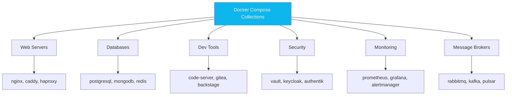
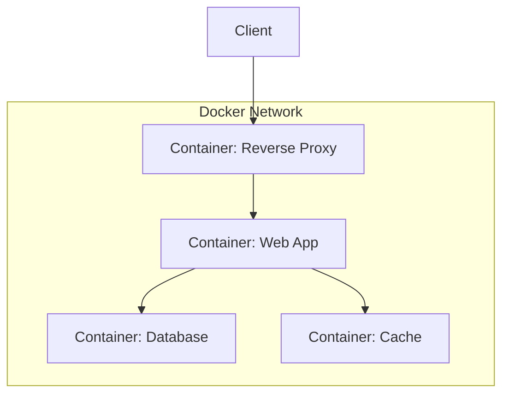
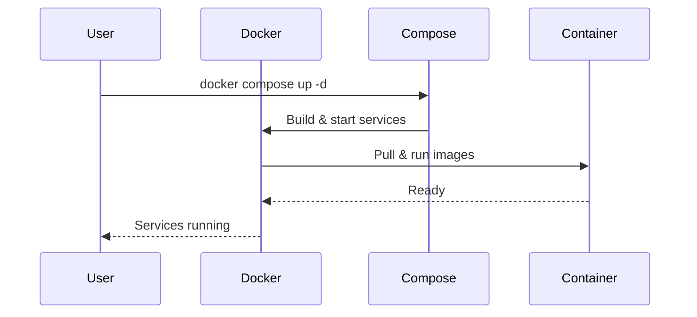

<div align="center">

 

<a href="LICENSE"></a>


  <p><strong> Ready-to-use Docker Compose stacks for development and self-hosted services.</strong></p>
</div>

## Table of Contents

- [Overview](#overview)
- [Architecture](#architecture)
- [Available Stacks](#available-stacks)
- [Quick Start](#quick-start)
- [Mermaid Diagrams](#mermaid-diagrams)
- [Guidelines](#guidelines)
- [References](#references)
- [Contributing](#contributing)
- [License](#license)

---

## Overview

This repository is a practical collection of Compose-based setups for common infrastructure and developer tooling.
Each folder contains a service stack you can run quickly and customize for your environment.

## What You Will Find

- Pre-configured Compose files for common services and tooling
- Stack examples with persistent storage and environment variables
- Service-specific README files with setup, usage, and operational notes
- Configurations that are easy to adapt for local labs and small deployments

## Architecture



## Available Stacks

### AI & Machine Learning

- [litellm](./litellm)
- [ollama](./ollama)
- [tesseract](./tesseract)

### Media & Photos

- [immich](./immich)

### Automation & Workflow

- [activepieces](./activepieces)
- [n8n](./n8n)
- [n8n+postgresql](./n8n+postgresql)
- [openclaw](./openclaw)

### Alerts & Notifications

- [apprise](./apprise)

### Social Media & Marketing Tools

- [listmonk](./listmonk)
- [mixpost](./mixpost)
- [postiz](./postiz)

### CI/CD & DevOps

- [floci](./floci)
- [gitlab](./gitlab)
- [gitea](./gitea)
- [gitea+jenkins](./gitea+jenkins)
- [jenkins](./jenkins)
- [semaphore](./semaphore)
- [sonarqube](./sonarqube)
- [ansible](./ansible)
- [chef](./chef)
- [openstack](./openstack)
- [opentofu](./opentofu)
- [consul](./consul)
- [puppet](./puppet)
- [woodpecker-ci](./woodpecker-ci)

### Knowledge Management

- [affine](./affine)
- [logseq](./logseq)
- [siyuan](./siyuan)

### Document Editor and Management

- [overleaf](./overleaf)
- [stirling-pdf](./stirling-pdf)

### Collaboration & Project Management

- [atlassian-jira](./atlassian-jira)
- [bitbucket](./bitbucket)
- [bugzilla](./bugzilla)
- [mattermost](./mattermost)
- [openproject](./openproject)
- [plane](./plane)
- [rocket-chat](./rocket-chat)
- [taiga](./taiga)
- [twake](./twake)

### Databases & Storage

- [adminer](./adminer)
- [cassandra](./cassandra)
- [couchdb](./couchdb)
- [dbx](./dbx)
- [documentdb](./documentdb)
- [meilisearch](./meilisearch)
- [neo4j](./neo4j)
- [miniio](./miniio)
- [mongodb-replicaset](./mongodb-replicaset)
- [mongodb-sharding-cluster](./mongodb-sharding-cluster)
- [parse-server+mongodb](./parse-server+mongodb)
- [postgrest](./postgrest)
- [redis](./redis)
- [supabase](./supabase)
- [vectordb](./vectordb)

### Message Brokers & Queuing

- [kafka](./kafka)
- [automq](./automq)
- [pulsar](./pulsar)
- [rabbitmq](./rabbitmq)

### Development Tools

- [backstage](./backstage)
- [code-server](./code-server)
- [devpi](./devpi)
- [it-tools](./it-tools)
- [jmeter](./jmeter)
- [jmeter-gui](./jmeter-gui)
- [localstack](./localstack)
- [portabase](./portabase)
- [registry](./registry)
- [scalar](./scalar)
- [swaggerui-openapi](./swaggerui-openapi)
- [verdaccio](./verdaccio)
- [xampp](./xampp)
- [wordpress](./wordpress)

### API Management

- [wso2-am](./wso2-am/)
- [wso2-am-mi](./wso2-am-mi/) (WSO2 API Manager + Micro Integrator + Node.js backend)

### Internal DNS Hosting & DNS Management

- [dnsmasq](./dnsmasq)
- [coredns](./coredns)
- [unbound](./unbound)
- [bind9](./bind9)
- [freeipa](./freeipa)

### Infrastructure & Security

- [authentik](./authentik)
- [dvwa](./dvwa)
- [juice-shop](./juice-shop)
- [keycloak](./keycloak)
- [nessus](./nessus)
- [pihole](./pihole)
- [portainer](./portainer)
- [suricata](./suricata)
- [trivy](./trivy)
- [snyk](./snyk)
- [vault](./vault)
- [vaultwarden](./vaultwarden)

### Load Balancers & Reverse Proxies

- [caddy](./caddy)
- [envoy](./envoy)
- [haproxy](./haproxy)
- [kong](./kong)
- [krakend](./krakend)
- [nginx-proxy-manager](./nginx-proxy-manager)
- [traefik](./traefik)
- [wso2-mi](./wso2-mi)

### Tunneling & Remote Access

- [pangolin](./pangolin)

### Monitoring & Observability

- [alertmanager](./alertmanager)
- [dozzle](./dozzle)
- [elasticsearch](./elasticsearch)
- [elasticsearch-kibana-filebeat](./elasticsearch-kibana-filebeat)
- [fluentbit](./fluentbit)
- [grafana-alloy](./grafana-alloy)
- [grafana-opentelemetry-tempo](./grafana-opentelemetry-tempo)
- [grafana-prometheus](./grafana-prometheus)
- [grafana-prometheus-alertmanager](./grafana-prometheus-alertmanager)
- [grafana-prometheus-krakend](./grafana-prometheus-krakend)
- [grafana-prometheus-kubenetes](./grafana-prometheus-kubenetes)
- [grafana-prometheus-loki-opentelemetry-tempo](./grafana-prometheus-loki-opentelemetry-tempo)
- [grafana-prometheus-loki-promtail](./grafana-prometheus-loki-promtail)
- [grafana-prometheus-mongodb](./grafana-prometheus-mongodb)
- [grafana-prometheus-node](./grafana-prometheus-node)
- [grafana-prometheus-opentelemetry-jaegerui](./grafana-prometheus-opentelemetry-jaegerui)
- [grafana-prometheus-proxmox](./grafana-prometheus-proxmox)
- [uptime-kuma](./uptime-kuma)
- [sentry](./sentry)
- [signoz](./signoz)
- [splunk](./splunk)

### Backups

- [restic](./restic)

### Visual Management

- [draw.io](./draw.io)
- [penpot](./penpot)

### Other Services

- [filebrowser](./filebrowser)
- [mailpit](./mailpit)
- [custom-linux-distr-base-arch](./custom-linux-distr-base-arch)

## Quick Start

1. Clone the repository:
   ```bash
   git clone https://github.com/marcuwynu23/docker-compose-collections.git
   ```
2. Enter a stack directory:
   ```bash
   cd docker-compose-collections/<stack-folder>
   ```
3. Start services:
   ```bash
   docker compose up -d
   # when needed:
   docker compose up -d --env-file .env
   ```
4. Stop services:
   ```bash
   docker compose down
   ```

## Podman Support

Most stacks can also run with Podman:
```bash
podman compose up -d
# when needed:
podman compose up -d --env-file .env
podman compose down
```

## Mermaid Diagrams





## Guidelines

### Best Practices

1. **Use `.env` files** for environment variables
2. **Set resource limits** in `docker-compose.yml`
   ```yaml
   services:
     app:
       deploy:
         resources:
           limits:
             memory: 512M
             cpus: "0.5"
   ```
3. **Use named volumes** for persistent data
4. **Use networks** for service isolation
   ```yaml
   networks:
     app:
       driver: bridge
   ```
5. **Pin image versions** to avoid breaking changes

### Troubleshooting

| Problem | Solution |
|---|---|
| Container not starting | Check logs: `docker compose logs <service>` |
| Port conflict | Change host port mapping |
| Build failure | Verify Dockerfile and base image |
| Network issues | Check: `docker network ls` |

### Useful Commands

```bash
docker compose up -d
docker compose down
docker compose logs -f
docker compose ps
docker compose build
docker compose restart <service>
```

## References

- [Docker Official Docs](https://docs.docker.com/)
- [Docker Compose Reference](https://docs.docker.com/compose/)
- [Docker Documentation](https://docs.docker.com/get-started/)
- [Podman Documentation](https://podman.io/getting-started/)
- [Docker Community](https://forums.docker.com/)

## Contributing

Contributions are welcome.
If you want to add or improve a stack, open a pull request with a short description of the use case and configuration.

## License

This project is licensed under the MIT License.
