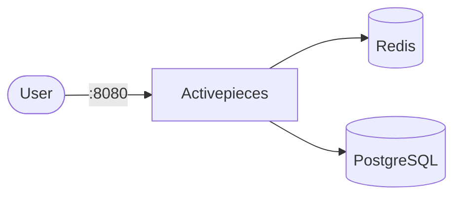

# Activepieces

Activepieces is an open-source workflow automation platform.  
This setup runs Activepieces with Redis and PostgreSQL dependencies.

## How it works



1. Redis provides cache/queue support.
2. PostgreSQL stores application/workflow data.
3. Activepieces starts after both dependencies are healthy.
4. The web app/API is exposed on port `8080`.

## Stack details in this repo

- Redis image: `redis:7`
- PostgreSQL image: `postgres:16`
- Activepieces image: `activepieces/activepieces:latest`
- Web UI: `http://<host-ip>:8080`
- Persistent data:
  - `redis_data:/data`
  - `postgres_data:/var/lib/postgresql/data`
  - `activepieces_data:/root/.activepieces`

## Environment variables

Copy `.env.example` to `.env` and update values:

- Redis: `AP_REDIS_HOST`, `AP_REDIS_PORT`
- Postgres: `AP_DATABASE_TYPE`, `AP_POSTGRES_*`
- App: `AP_FRONTEND_URL`, `AP_ENCRYPTION_KEY`, `AP_JWT_SECRET`
- Optional behavior: `AP_TELEMETRY_ENABLED`, `AP_SYNC_PIECES_ON_STARTUP`

Generate a secure encryption key if needed:

```bash
openssl rand -hex 16
```

## How to run

From the repository root:

```bash
cd activepieces
cp .env.example .env
docker compose up -d
```

Open:

- `http://localhost:8080`

Useful commands:

```bash
docker compose ps
docker compose logs -f
docker compose restart
docker compose down
docker compose down -v
```

## Notes

- Keep `AP_ENCRYPTION_KEY` and `AP_JWT_SECRET` private.
- If startup takes longer, check health of `redis` and `db` first.
