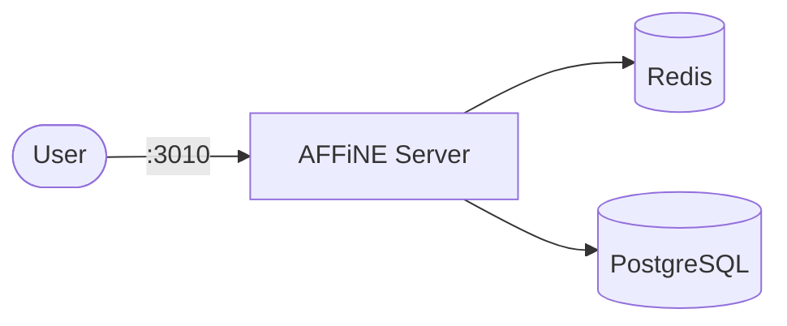

# AFFiNE

AFFiNE is an open-source knowledge base that combines docs, whiteboards, and databases — a privacy-focused alternative to Notion and Miro.

## How AFFiNE works



1. AFFiNE starts with a migration job that prepares the database schema.
2. The main server provides a web UI for documents, whiteboards, and databases.
3. Redis handles session caching and job queues.
4. PostgreSQL stores all persistent data.

## Stack details in this repo

- Image: `ghcr.io/toeverything/affine:stable`
- Container name: `affine`
- Web UI: `http://<host-ip>:3010`
- Dependencies: Redis 7, PostgreSQL 16 (pgvector)

## How to run

From the repository root:

```bash
cd affine
docker compose up -d
```

Open:

- AFFiNE UI: `http://localhost:3010`

Useful commands:

```bash
docker compose ps
docker compose logs -f
docker compose restart
docker compose down
```

## Use it effectively

- AFFiNE supports Markdown and rich-text editing for documents.
- Use the whiteboard mode for visual brainstorming and diagrams.
- Databases allow structured data with custom fields and views.
- Set up user accounts from the admin panel on first run.

## Notes

- The migration job runs once on startup and exits — it must complete before the main server starts.
- Persistent data is stored in `./data/` (configurable via environment variables).
- Change the host port via the `AFFINE_PORT` environment variable.
- See [AFFiNE GitHub](https://github.com/toeverything/AFFiNE) for more details.
