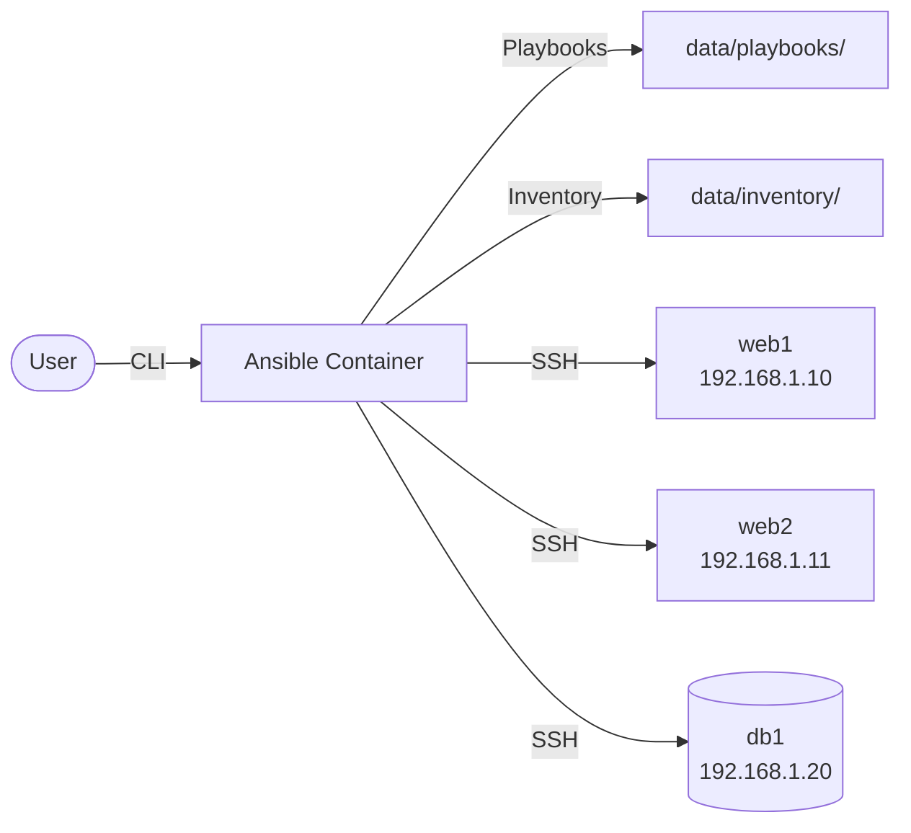
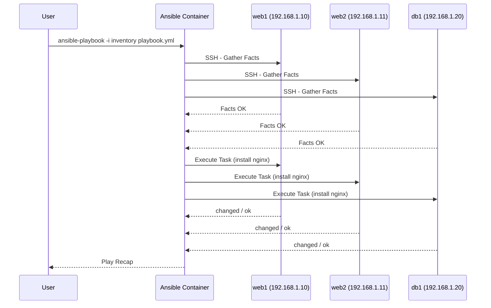

# Ansible

Ansible is an automation engine for configuration management, application deployment, and task orchestration.  
This stack runs the official Ansible container image for executing playbooks against remote hosts.

## How it works



Playbook execution flow:



1. Place your Ansible playbooks in `data/playbooks/` and inventory files in `data/inventory/`.
2. Start the container — it runs in the background, ready to execute commands.
3. Use `docker compose exec` to run `ansible-playbook` or other Ansible CLI commands.
4. Ansible connects to target hosts defined in your inventory via SSH or WinRM.

## Stack details in this repo

- Image: `ansible/ansible:latest`
- Working directory inside container: `/playbooks`
- Persistent data:
  - `./playbooks/` — maps to `/playbooks` (your playbooks)
  - `./inventory/` — maps to `/inventory` (your inventory files)

## How to run

From the repository root:

```bash
cd ansible
docker compose up -d
```

Useful commands:

```bash
docker compose exec ansible ansible-playbook -i /inventory/hosts playbook.yml
docker compose exec ansible ansible-inventory -i /inventory/hosts --list
docker compose exec ansible ansible all -i /inventory/hosts -m ping
docker compose logs -f
docker compose down
```

## Example files

The repository includes example files to get started:

- `./playbooks/main.yml` — playbook that installs and starts nginx
- `./inventory/inventory.ini` — sample inventory with `[web]` and `[db]` groups

## Notes

- Create your own playbooks and inventory files under `data/` — the folder is gitignored-friendly and easy to back up.
- For Windows targets, adjust `ansible_connection` in the inventory to `winrm`.
- The container does not run playbooks on startup; it is designed for interactive CLI use via `docker compose exec`.
