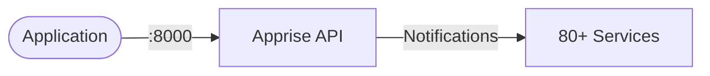

# Apprise API

Apprise is a push notification library that supports 80+ notification services.  
This setup runs the Apprise API server for sending notifications.

## How it works



1. Apprise API exposes a RESTful interface on port `8000`.
2. Send notifications to various services (Slack, Discord, Telegram, Email, etc.).
3. Configuration is loaded from `/config/apprise.yml`.

## Stack details in this repo

- Apprise image: `caronc/apprise:latest`
- API endpoint: `http://<host-ip>:8000`
- Configuration file: `./apprise/config/apprise.yml`
- Persistent data: Notification configuration mounted through volumes

## Environment variables

Copy `.env.example` to `.env` if needed for custom configuration.

## Configuration

Create your `apprise.yml` file in `./apprise/config/`.

Example using Telegram only:

```yaml
urls:
  - tgram://BOT_TOKEN/CHAT_ID
```

Example with multiple notification services:

```yaml
urls:
  - slack://token@channel
  - discord://webhook_id/webhook_token
  - tgram://BOT_TOKEN/CHAT_ID
```

Directory structure:

```text
apprise/
├── docker-compose.yml
└── apprise/
    └── config/
        └── apprise.yml
```

## How to run

From the repository root:

```bash
cd apprise
docker compose up -d
```

Open in browser:

```text
http://localhost:8000
```

Useful commands:

```bash
docker compose ps
docker compose logs -f
docker compose restart
docker compose down
```

## How to use

Apprise stores notification configurations using keys.

The default configuration key used in this setup is:

```text
apprise
```

You can verify configured services:

```bash
curl http://localhost:8000/json/urls/apprise
```

Example response:

```json
{
  "urls": [
    {
      "service_name": "Telegram"
    }
  ]
}
```

### Send notification using cURL

Windows CMD:

```cmd
curl -X POST http://localhost:8000/notify/apprise -H "Content-Type: application/json" -d "{\"title\":\"Deployment\",\"body\":\"Application deployed successfully\"}"
```

Linux/macOS:

```bash
curl -X POST http://localhost:8000/notify/apprise \
-H "Content-Type: application/json" \
-d '{
  "title":"Deployment",
  "body":"Application deployed successfully"
}'
```

Expected response:

```json
{
  "error": null,
  "details": [["INFO", "Sent Telegram notification."]]
}
```

### Send notification from JavaScript

```javascript
await fetch("http://localhost:8000/notify/apprise", {
  method: "POST",
  headers: {
    "Content-Type": "application/json",
  },
  body: JSON.stringify({
    title: "Build Status",
    body: "CI pipeline completed successfully",
  }),
});
```

### Send notification from Node.js (Axios)

```javascript
import axios from "axios";

await axios.post("http://localhost:8000/notify/apprise", {
  title: "Deployment",
  body: "Production deployment completed",
});
```

### GitHub Actions example

```yaml
- name: Send deployment notification
  run: |
    curl -X POST http://your-server:8000/notify/apprise \
    -H "Content-Type: application/json" \
    -d '{
      "title":"Deployment",
      "body":"Production deployment completed successfully"
    }'
```

## Troubleshooting

View logs:

```bash
docker compose logs -f
```

Verify running containers:

```bash
docker compose ps
```

Verify configured notification URLs:

```bash
curl http://localhost:8000/json/urls/apprise
```

Common issue:

```text
No valid URLs provided
```

Cause:

- Configuration exists but notification request was sent without specifying the configuration key.

Correct:

```text
POST /notify/apprise
```

Incorrect:

```text
POST /notify
```

## Rotation Notes

- Regularly rotate notification tokens and credentials.
- Avoid committing notification secrets into Git.
- Use `.env`, Docker secrets, or secret managers for production environments.
- Monitor logs for notification failures.
- Implement retry handling for critical notification workflows.
