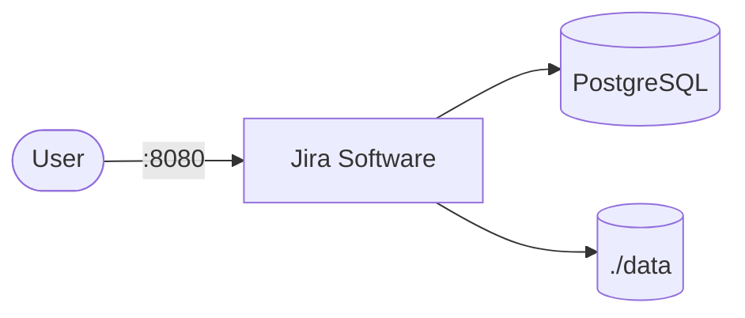

# Atlassian Jira

Jira is a project management and issue tracking platform by Atlassian.  
It supports agile boards, workflows, sprints, and backlog management for software teams.

## How Jira works



1. Jira starts and serves the web UI on port 8080.
2. PostgreSQL stores all project data, issues, users, and workflows.
3. Application data (attachments, plugins, logs) persists in the `./data` volume.
4. On first access, Jira runs a setup wizard to configure license and admin account.

## Stack details in this repo

- Jira image: `atlassian/jira-software:latest`
- Database image: `postgres:15`
- Container names: `jira`, `postgres`
- Web UI: `http://<host-ip>:8080`
- PostgreSQL port: `5432`
- Persistent data:
  - `./data:/var/atlassian/application-data/jira`
  - `db-data:/var/lib/postgresql/data`

## Environment variables

Configured directly in `docker-compose.yml`:

- `ATL_JDBC_URL` — JDBC connection string to PostgreSQL
- `ATL_JDBC_USER` — database username (default: `admin`)
- `ATL_JDBC_PASSWORD` — database password (default: `Password@123`)
- `POSTGRES_USER` — PostgreSQL user
- `POSTGRES_PASSWORD` — PostgreSQL password
- `POSTGRES_DB` — database name (default: `jiradb`)

## How to run

From the repository root:

```bash
cd atlassian-jira
docker compose up -d
```

Open:

- Jira UI: `http://localhost:8080`

Follow the setup wizard on first launch to configure your license and admin account.

Useful commands:

```bash
docker compose ps
docker compose logs -f jira
docker compose restart
docker compose down
```

## Use it effectively

- Use Scrum or Kanban boards to manage sprints and workflows.
- Configure custom issue types and workflows for your team's process.
- Integrate with Bitbucket, Confluence, or CI/CD tools for traceability.
- Export backups regularly from Administration → System → Backup.

## Notes

- Change default database credentials before exposing externally.
- Jira requires a valid license (free trial available from Atlassian).
- First startup can take several minutes while the database initializes.
- Allocate at least 2GB RAM to the host for smooth operation.
