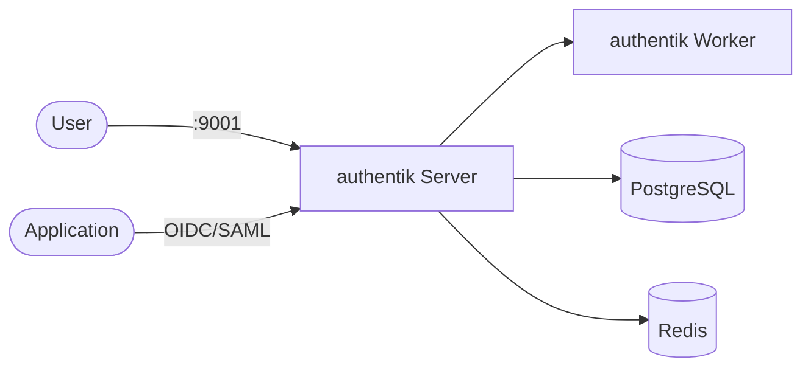

# authentik

authentik is an open-source identity provider (IdP) and SSO platform for applications and internal services.

## How it works



1. `authentik-server` provides the UI/API.
2. `authentik-worker` runs background jobs and outposts.
3. PostgreSQL stores configuration and identity data.
4. Redis is used for cache and queue processing.

## Stack details in this repo

- Server image: `ghcr.io/goauthentik/server:latest`
- Worker image: `ghcr.io/goauthentik/server:latest`
- Dependencies: `postgres:16`, `redis:7`
- UI endpoint: `http://<host-ip>:9001`
- Persistent data: named volumes (`database`, `redis`, `media`, `certs`, `custom-templates`)

## Environment variables

Copy `.env.example` to `.env`:

- `AUTHENTIK_PORT`
- `AUTHENTIK_POSTGRES_USER`
- `AUTHENTIK_POSTGRES_PASSWORD`
- `AUTHENTIK_POSTGRES_DB`
- `AUTHENTIK_SECRET_KEY` (set a strong random value)

## How to run

```bash
cd authentik
cp .env.example .env
docker compose up -d
```

Podman:

```bash
cd authentik
cp .env.example .env
podman compose up -d
```

## Reset admin password

If login fails and you need to reset the `akadmin` password:

```bash
podman compose exec authentik-server ak changepassword akadmin
```

Then sign in again with username `akadmin` and the new password.

## Notes

- First startup can take a few minutes.
- Set a strong `AUTHENTIK_SECRET_KEY` before production use.
