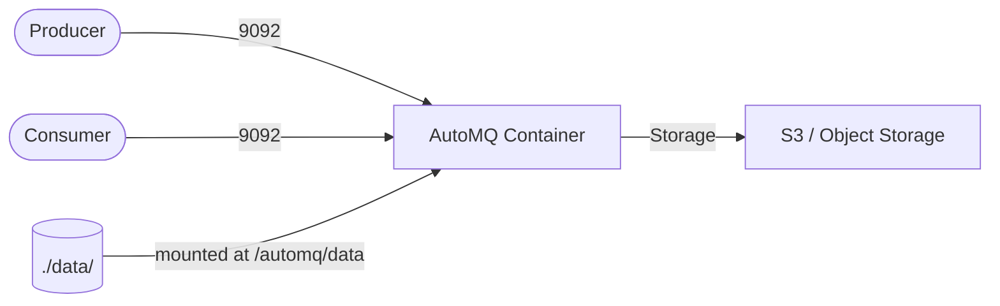
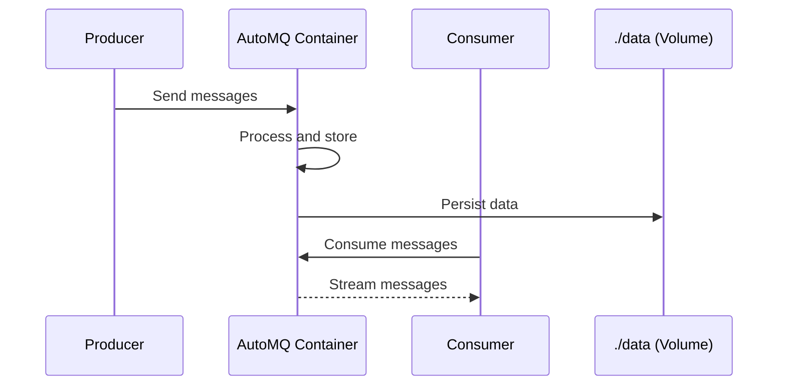

# AutoMQ

AutoMQ is a cloud-native, cost-effective, and high-performance Kafka alternative built on S3-compatible object storage. This stack runs the official AutoMQ for Kafka container image for streaming data pipelines.

## How it works





1. AutoMQ starts a Kafka-compatible broker.
2. Producers and consumers connect on port 9092.
3. Web UI/management accessible on port 8080.
4. Data persisted in `data/` directory.
5. Fully compatible with Kafka clients and tools.

## Stack details in this repo

- Image: `automqinc/automq-for-kafka:latest`
- Persistent data:
  - `./data/` — maps to `/automq/data` (AutoMQ data directory)
- Exposed ports:
  - `9092` — Kafka-compatible broker
  - `8080` — Web UI/management interface

## How to run

From the repository root:

```bash
cd automq
docker compose up -d
```

Useful commands:

```bash
# Check logs
docker compose logs -f

# Stop services
docker compose down
```

## Notes

- AutoMQ is fully compatible with Apache Kafka APIs.
- You can use standard Kafka clients (librdkafka, kafka-python, etc.) to connect.
- Access the management UI at http://localhost:8080
- For production, consider configuring proper object storage backend (S3, MinIO, etc.)

## References

- Official site: <https://www.automq.com/>
- Documentation: <https://docs.automq.com/>
- Docker deploy guide: <https://docs.automq.com/automq/getting-started/deploy-multi-nodes-test-cluster-on-docker>
- GitHub repo: <https://github.com/AutoMQ/automq-for-kafka>
- Docker Hub image: <https://hub.docker.com/r/automqinc/automq>
- YouTube — AutoMQ: A New Kafka Alternative on S3 (The Geek Narrator): <https://www.youtube.com/watch?v=sFIqo1QUE_Y>
