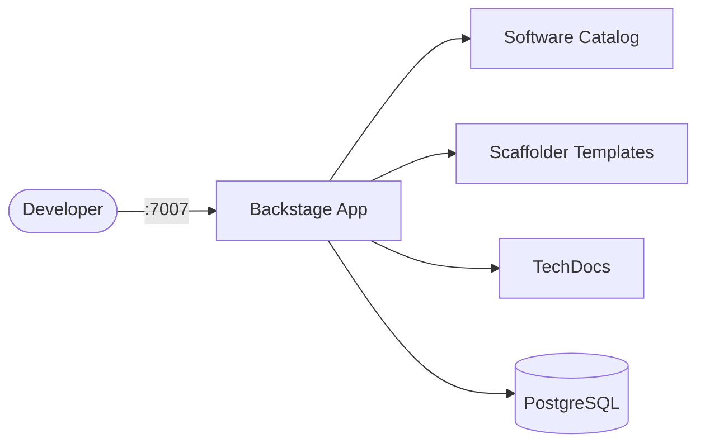

# Backstage

Backstage is an open platform for building developer portals.  
It unifies infrastructure tooling, services, and documentation into a single catalog-driven UI.

## How Backstage works



1. Developers access the Backstage portal via the web UI.
2. The software catalog indexes services, libraries, and infrastructure components.
3. Scaffolder templates let teams create new projects from standardized blueprints.
4. TechDocs renders markdown documentation alongside the catalog entries.
5. PostgreSQL stores catalog state, user data, and plugin metadata.

## Stack details in this repo

- Backstage image: `backstage/backstage:latest`
- Database image: `postgres:16-alpine`
- Container names: `backstage`, `backstage-db`
- Backstage UI: `http://<host-ip>:7007`
- PostgreSQL port: `5432` (internal only)

## Environment variables

Set via `.env` (copy from `.env.example`):

- `BACKSTAGE_PORT` (default: `7007`)
- `POSTGRES_USER` (default: `backstage`)
- `POSTGRES_PASSWORD` (default: `changeme`)
- `POSTGRES_DB` (default: `backstage`)

## How to run

From the repository root:

```bash
cd backstage
cp .env.example .env
docker compose up -d
```

Open:

- Backstage UI: `http://localhost:7007`

Useful commands:

```bash
docker compose ps
docker compose logs -f backstage
docker compose restart
docker compose down
```

## Use it effectively

- Register services in the software catalog using `catalog-info.yaml` files in your repos.
- Create scaffolder templates to standardize new project creation across teams.
- Enable TechDocs to render markdown docs directly in the portal.
- Add plugins for CI/CD visibility, Kubernetes, cost management, and more.

## Notes

- Change the default database password before exposing externally.
- The official image ships with a demo catalog; customize `app-config.yaml` for your org.
- For production, mount a custom `app-config.production.yaml` via volumes.
- See [Backstage docs](https://backstage.io/docs) for full configuration and plugin reference.
