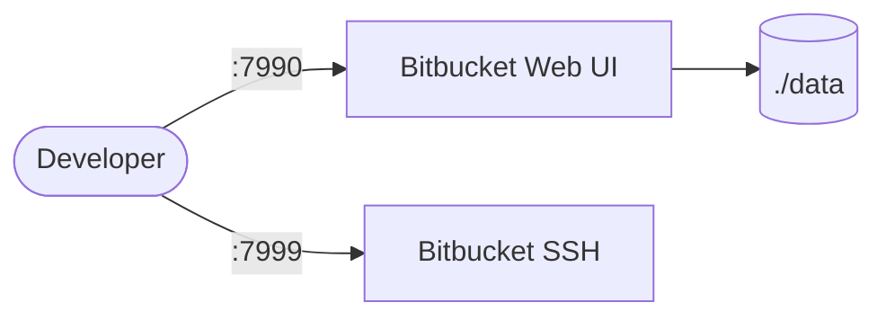

# Bitbucket

Bitbucket Server (now Bitbucket Data Center) is a self-hosted Git repository management solution by Atlassian.  
It provides code hosting, pull requests, branch permissions, and CI/CD integration.

## How Bitbucket works



1. Bitbucket starts and serves the web UI on port 7990.
2. Git SSH access is available on port 7999 for clone/push operations.
3. Repository data, configuration, and plugins persist in the `./data` volume.
4. On first access, Bitbucket runs a setup wizard to configure license and admin account.

## Stack details in this repo

- Image: `atlassian/bitbucket:10.2.2`
- Container name: `bitbucket`
- Web UI: `http://<host-ip>:7990`
- SSH port: `7999`
- Persistent data:
  - `./data:/var/atlassian/application-data/bitbucket`

## Environment variables

Configured directly in `docker-compose.yml`:

- `JVM_MINIMUM_MEMORY` (default: `1g`)
- `JVM_MAXIMUM_MEMORY` (default: `2g`)
- `CATALINA_OPTS` — JVM tuning for container memory limits

## How to run

From the repository root:

```bash
cd bitbucket
docker compose up -d
```

Open:

- Bitbucket UI: `http://localhost:7990`

Follow the setup wizard on first launch to configure your license and admin account.

Useful commands:

```bash
docker compose ps
docker compose logs -f bitbucket
docker compose restart
docker compose down
```

## Use it effectively

- Clone repos via SSH: `git clone ssh://git@localhost:7999/<project>/<repo>.git`
- Configure branch permissions to enforce code review via pull requests.
- Integrate with Jira for issue linking and traceability.
- Use webhooks to trigger CI/CD pipelines on push events.

## Notes

- Bitbucket requires a valid license (free trial available from Atlassian).
- First startup can take several minutes; check logs if the UI is not immediately available.
- Allocate at least 2GB RAM — the JVM settings in compose are tuned for container environments.
- The embedded database (H2) is used by default; for production, configure an external PostgreSQL database.
