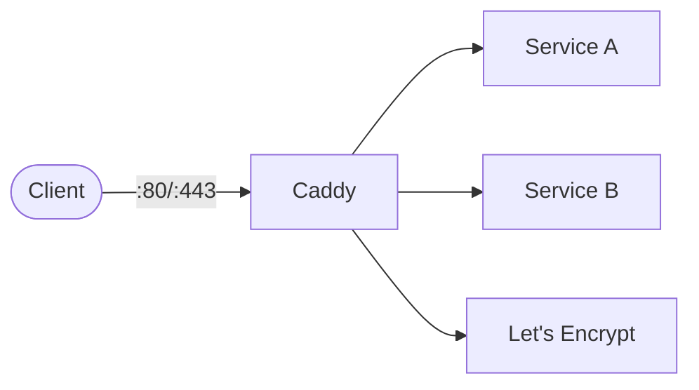

# Caddy

Caddy is a modern web server with automatic HTTPS, reverse proxy, and load balancing built in.  
It uses a simple Caddyfile for configuration and handles TLS certificates automatically via Let's Encrypt.

## How Caddy works



1. Caddy listens on HTTP/HTTPS ports and routes requests based on the Caddyfile.
2. TLS certificates are automatically provisioned and renewed via ACME (Let's Encrypt).
3. Reverse proxy rules forward traffic to upstream services.
4. Configuration is defined in a single `Caddyfile` — no YAML or JSON needed.

## Stack details in this repo

- Image: `caddy:2-alpine`
- Container name: `caddy`
- HTTP port: `80`
- HTTPS port: `443`
- Persistent data:
  - `caddy_data:/data` (certificates)
  - `caddy_config:/config`

## Environment variables

Set via `.env` (copy from `.env.example`):

- `CADDY_HTTP_PORT` (default: `80`)
- `CADDY_HTTPS_PORT` (default: `443`)

## How to run

From the repository root:

```bash
cd caddy
cp .env.example .env
docker compose up -d
```

Test:

```bash
curl http://localhost
```

Useful commands:

```bash
docker compose ps
docker compose logs -f
docker compose restart
docker compose down
```

## Use it effectively

- Edit `Caddyfile` to add reverse proxy rules, file serving, or redirects.
- Use domain names in the Caddyfile to trigger automatic HTTPS.
- Caddy supports on-demand TLS, wildcard certs, and custom certificate authorities.
- Reload config without downtime: `docker compose exec caddy caddy reload --config /etc/caddy/Caddyfile`

## Notes

- Automatic HTTPS requires a publicly reachable domain and ports 80/443 open.
- For local development, Caddy serves HTTP or uses self-signed certs.
- See [Caddy docs](https://caddyserver.com/docs/) for full Caddyfile reference.
