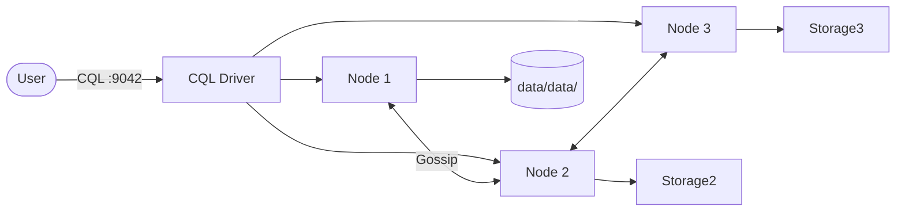
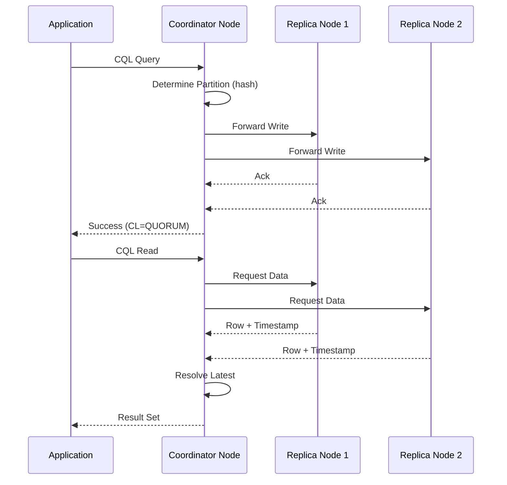

# Cassandra

Apache Cassandra is a distributed, wide-column NoSQL database designed for high availability, linear scalability, and fault tolerance across commodity hardware.  
It is commonly used for time-series data, IoT, messaging, and real-time analytics workloads.

## How it works





1. Applications connect via the **CQL binary protocol** (port `9042`) using drivers for Java, Python, Node.js, Go, and more.
2. A **coordinator node** receives the query, determines which nodes own the data via consistent hashing, and forwards the request.
3. Data is automatically replicated across multiple nodes based on the **replication factor** set per keyspace.
4. Cassandra achieves linear scalability — adding more nodes increases throughput without downtime.

## Stack details in this repo

- Image: `cassandra:latest`
- CQL (Thrift): `localhost:9160`
- CQL (native): `localhost:9042`
- Persistent data:
  - `./data/data/` — SSTable data files
  - `./data/commitlog/` — commit log for crash recovery
  - `./data/saved_caches/` — key/key-range caches
  - `./data/logs/` — system logs
  - `./data/conf/` — custom configuration overrides

## Environment variables

Set via `.env`:

| Variable | Default | Description |
|----------|---------|-------------|
| `CLUSTER_NAME` | `MyCluster` | Logical cluster name |
| `DATACENTER` | `dc1` | Datacenter name |
| `RACK` | `rack1` | Rack name |
| `SNITCH` | `GossipingPropertyFileSnitch` | Topology strategy |
| `NUM_TOKENS` | `256` | Virtual nodes per node |
| `MAX_HEAP` | `512M` | Maximum JVM heap size |
| `HEAP_NEWSIZE` | `100M` | Young generation heap size |

## How to run

From the repository root:

```bash
cd cassandra
docker compose up -d
```

Useful commands:

```bash
docker compose ps
docker compose logs -f
docker compose exec cassandra nodetool status
docker compose exec cassandra cqlsh
docker compose down
docker compose down -v
```

## How to use

### Connect with cqlsh

```bash
docker compose exec cassandra cqlsh
```

### Create a keyspace and table

```sql
CREATE KEYSPACE IF NOT EXISTS store
WITH replication = {'class': 'SimpleStrategy', 'replication_factor': 1};

USE store;

CREATE TABLE IF NOT EXISTS products (
    id UUID PRIMARY KEY,
    name text,
    price decimal,
    category text,
    created_at timestamp
);
```

### Insert and query data

```sql
INSERT INTO products (id, name, price, category, created_at)
VALUES (uuid(), 'Widget', 19.99, 'tools', toTimestamp(now()));

SELECT * FROM products WHERE category = 'tools' ALLOW FILTERING;
```

### Use with Python

```python
from cassandra.cluster import Cluster

cluster = Cluster(["localhost"], port=9042)
session = cluster.connect("store")

rows = session.execute("SELECT name, price FROM products LIMIT 10")
for row in rows:
    print(f"{row.name}: ${row.price}")
```

## Notes

- `SimpleStrategy` replication is fine for single-DC labs; use `NetworkTopologyStrategy` for multi-DC production deployments.
- Run `nodetool status` to verify the cluster is healthy after startup.
- The first startup seeds the cluster — it may take 30–60 seconds before `cqlsh` is available.
- For multi-node clusters, add more `cassandra` services in the compose file with different seeds and advertise addresses.
