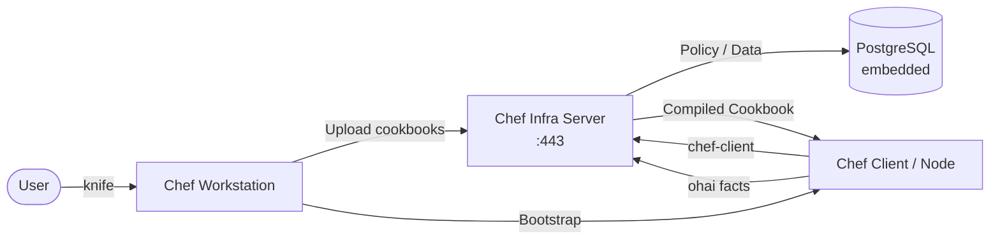
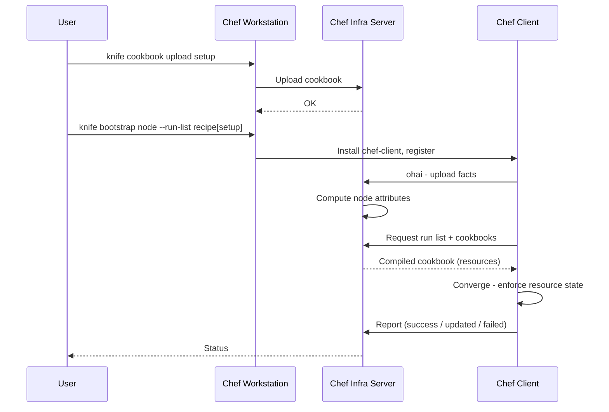

# Chef

Chef is a configuration management and infrastructure automation platform that uses a declarative DSL (Ruby-based) to define system state as **cookbooks** and **recipes**.  
This stack runs Chef Infra Server with a Chef Workstation container for managing nodes and cookbooks.

## How it works



Node check-in and converge flow:



1. Cookbook development happens on the **workstation** container — recipes, templates, and attributes are authored in Ruby DSL.
2. Use `knife cookbook upload` to publish cookbooks to the Chef Infra Server.
3. Nodes run the `chef-client` agent (or are bootstrapped via `knife bootstrap`) to register with the server.
4. During a **converge** run, the client sends facts (via **ohai**), requests its run list, downloads the compiled cookbook, and applies every resource declaration to reach the desired state.
5. A report is sent back to the server after each run detailing changes, successes, and failures.

## Stack details in this repo

| Service | Image | Port | Purpose |
|---------|-------|------|---------|
| `chef-server` | `chef/chef-server:latest` | `443` | Chef Infra Server (API + Web UI) |
| `chef-workstation` | `chef/chef:latest` | — | CLI tools: `knife`, `chef-client`, `ohai` |

Persistent data:

- `./data/server/config/` — Chef Server configuration
- `./data/server/data/` — Chef Server runtime data (embedded PostgreSQL, Solr)
- `./data/server/logs/` — Chef Server access and error logs
- `./data/workstation/` — Workstation home directory (`.chef/`, SSL certs)
- `./cookbooks/` — Local cookbook development directory

## Environment variables

Set via `.env`:

| Variable | Default | Description |
|----------|---------|-------------|
| `CHEF_SERVER_FQDN` | `chef-server` | Fully qualified domain name of the Chef Server |

## How to run

From the repository root:

```bash
cd chef
docker compose up -d
```

Useful commands:

```bash
docker compose ps
docker compose logs -f chef-server
docker compose exec chef-workstation knife --help
docker compose down
docker compose down -v
```

## How to use

### Initialize the Chef Server (first run)

```bash
# Reconfigure the server after first startup
docker compose exec chef-server chef-server-ctl reconfigure

# Create an admin user
docker compose exec chef-server chef-server-ctl user-create admin Admin User admin@example.com 'password123' --filename /etc/chef-server/admin.pem

# Create an organization
docker compose exec chef-server chef-server-ctl org-create myorg 'My Organization' --association_user admin --filename /etc/chef-server/myorg-validator.pem
```

### Configure Knife on the workstation

```bash
# Copy credentials from the server
docker compose exec chef-workstation mkdir -p /root/.chef
docker compose exec chef-workstation cp /etc/chef-server/admin.pem /root/.chef/
docker compose exec chef-workstation cp /etc/chef-server/myorg-validator.pem /root/.chef/

# Create knife.rb
docker compose exec chef-workstation bash -c 'cat > /root/.chef/knife.rb << EOF
current_dir = File.dirname(__FILE__)
log_level                :info
log_location             STDOUT
node_name                "admin"
client_key               "#{current_dir}/admin.pem"
chef_server_url          "https://chef-server/organizations/myorg"
cookbook_path            ["/cookbooks"]
EOF'
```

### Upload a cookbook

```bash
docker compose exec chef-workstation knife cookbook upload setup
```

### List nodes and cookbooks

```bash
docker compose exec chef-workstation knife node list
docker compose exec chef-workstation knife cookbook list
docker compose exec chef-workstation knife client list
```

### Bootstrap a remote node

```bash
docker compose exec chef-workstation knife bootstrap <NODE_IP> \
  --ssh-user root \
  --sudo \
  --node-name <NODE_NAME> \
  --run-list 'recipe[setup]'
```

## Example files

The repository includes example files to get started:

- `cookbooks/setup/recipes/default.rb` — recipe that installs packages, manages a service, and writes a motd file
- `cookbooks/setup/recipes/webserver.rb` — recipe that installs and configures nginx
- `examples/default.rb.example` — standalone copy of a basic recipe

## Notes

- First startup takes 2–5 minutes while Chef Server initialises embedded PostgreSQL and Solr. Watch `docker compose logs -f chef-server` for readiness.
- The Chef Server Web UI is available at `https://localhost/` (accept the self-signed certificate warning).
- Chef Server uses **self-signed SSL certificates** by default. For production, configure proper certificates in `data/server/config/`.
- Cookbooks are authored in **Ruby DSL** — see the [Chef Infra Language docs](https://docs.chef.io/infra_language/) for resource types (`package`, `service`, `file`, `template`, `execute`, etc.).
- The workstation container includes `chef-client` and `ohai` — use them for local apply testing.
- Manage cookbook dependencies with `Berkshelf` (`knife cookbook` can also use `--berks`).
