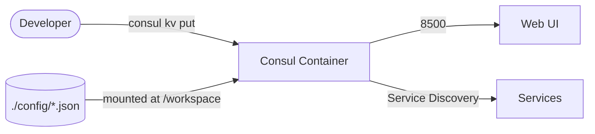
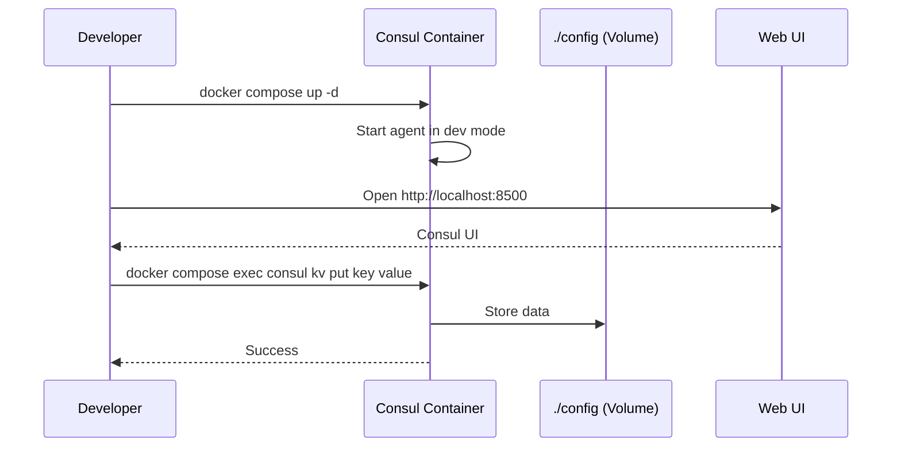

# Consul

Consul is a service networking solution to connect and configure services across any runtime platform and public or private cloud. This stack runs the official Consul container image for service discovery, service mesh, and key-value storage.

## How it works





1. Consul starts in development mode for easy testing.
2. Web UI is accessible at http://localhost:8500.
3. Use `docker compose exec` to run Consul commands.
4. Configuration files can be placed in `config/` for persistence.
5. Provides service discovery, health checking, KV store, and service mesh capabilities.

## Stack details in this repo

- Image: `hashicorp/consul:latest`
- Persistent data:
  - `./config/` — maps to `/consul/data` (Consul data directory)
- Exposed ports:
  - `8500` — HTTP API and Web UI

## How to run

From the repository root:

```bash
cd consul
docker compose up -d
```

Useful commands:

```bash
docker compose exec consul consul members
docker compose exec consul consul kv put mykey myvalue
docker compose exec consul consul kv get mykey
docker compose logs -f
docker compose down
```

## Notes

- This runs Consul in development mode, which is not suitable for production.
- For production deployments, you'll want to configure a proper cluster with persistent storage.
- Place any Consul configuration files in the `config/` directory.
- Access the Web UI at http://localhost:8500
