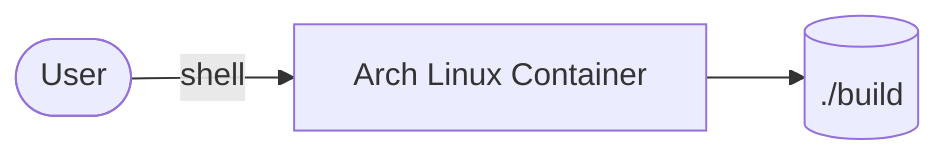

# Custom Linux Distro Base (Arch ISO Builder)

This setup provides an Arch Linux containerized environment for building custom ISO artifacts using `archiso`.

## How it works



1. A privileged Arch Linux container starts in interactive shell mode.
2. Host `./build` directory is mounted into `/build` in the container.
3. You run ArchISO tooling from inside the container.
4. Output artifacts are written back to the host `build` folder.

## Stack details in this repo

- Image: `archlinux:latest`
- Container name: `archiso-builder`
- Runtime mode:
  - `privileged: true`
  - `network_mode: host`
  - interactive TTY enabled
- Mounted path:
  - `./build:/build`

## Environment variables

No environment variables are required by this compose file.

## How to run

From the repository root:

```bash
cd custom-linux-distr-base-arch
docker compose up -d
docker exec -it archiso-builder bash
```

Useful commands:

```bash
docker compose ps
docker compose logs -f
docker compose down
```

## Notes

- Privileged mode gives broad host capabilities; use on trusted environments.
- Keep build scripts/assets under `build/` so output persists on host.
