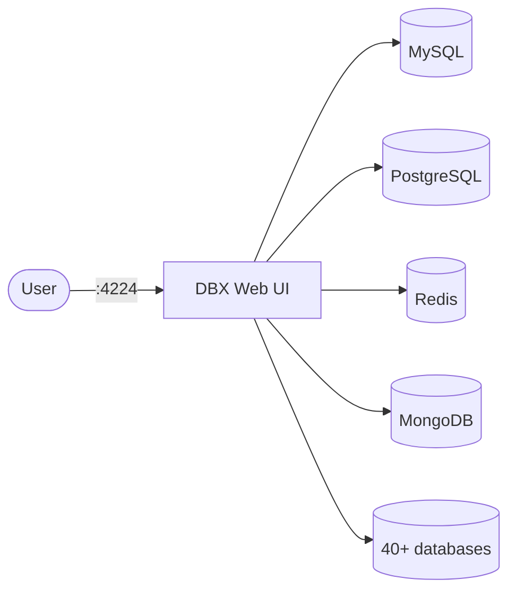

# DBX

DBX is a lightweight, cross-platform database client with web UI, supporting 40+ databases.

## How it works



1. DBX starts a web server on port 4224.
2. Connect to any supported database through the browser interface.
3. Browse tables, run SQL queries, and manage connections.
4. Data persists in `dbx-data` volume.

## Stack details in this repo

- Image: `t8y2/dbx:latest`
- Container name: `dbx`
- Endpoint: `http://<host-ip>:4224`
- Persistent data:
  - `dbx-data:/app/data`

## How to run

```bash
cd dbx
docker compose up -d
```

Podman:

```bash
cd dbx
podman compose up -d
```

Open `http://localhost:4224` in your browser.

## References

- Official site: <https://dbxio.com>
- Documentation: <https://dbxio.com/en/docs/getting-started>
- GitHub repo: <https://github.com/t8y2/dbx>
- Docker Hub image: <https://hub.docker.com/r/t8y2/dbx>
- YouTube — DBX Is Almost the Perfect Free Database Client: <https://www.youtube.com/watch?v=b6rVCrBPbe8>
