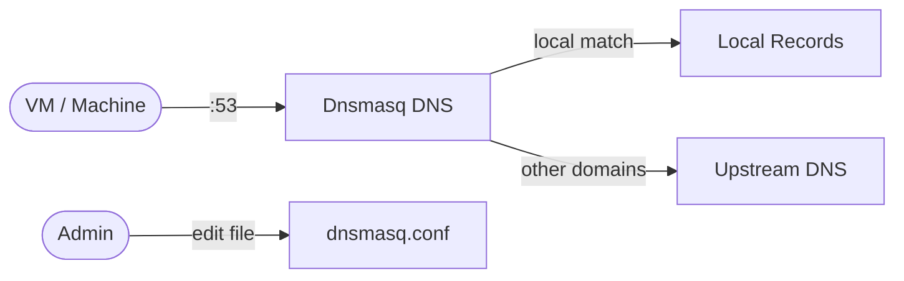
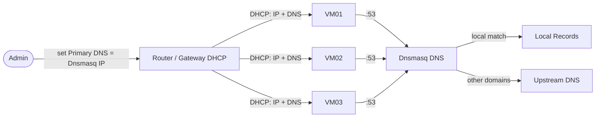

# Dnsmasq

Dnsmasq is a lightweight DNS forwarder and DHCP server for small networks and labs.  
Point your VMs and machines to Dnsmasq as DNS, and it resolves your custom local records while forwarding everything else to upstream resolvers.

## How Dnsmasq works



1. A VM or machine asks for a domain (for example, `vm01.marcuwynu23.local`).
2. Dnsmasq checks `dnsmasq.conf` for `address=/.../` matches.
3. If matched, Dnsmasq returns the configured local IP directly.
4. If not matched, Dnsmasq forwards the request to upstream servers (`10.126.90.124`, `1.1.1.1`, `8.8.8.8` in this repo).
5. Dnsmasq caches responses to speed up future lookups.

## Stack details in this repo

- Image: `jpillora/dnsmasq`
- Container name: `dnsmasq`
- DNS ports exposed: `53/tcp`, `53/udp`
- DHCP port exposed: `67/udp`
- Config file (read-only mount):
  - `./dnsmasq/dnsmasq.conf:/etc/dnsmasq.conf:ro`
- Local domain in this repo: `marcuwynu23.local`
- Local records in this repo:
  - `dns.marcuwynu23.local` → `10.126.90.210`
  - `gateway.marcuwynu23.local` → `10.126.90.124`
  - `vm01.marcuwynu23.local` → `10.126.90.101`
  - `vm02.marcuwynu23.local` → `10.126.90.102`
  - `vm03.marcuwynu23.local` → `10.126.90.103`
- Upstream servers in this repo:
  - `10.126.90.124`
  - `1.1.1.1`
  - `8.8.8.8`

## Environment variables

This compose setup does not use a `.env` file by default. All configuration is done in `dnsmasq/dnsmasq.conf`:

- `domain` — local DNS suffix (current: `marcuwynu23.local`)
- `local=/marcuwynu23.local/` — answer locally, never forward this zone upstream
- `address=/<name>/ <ip>` — add one line per local A record
- `server=<ip>` — upstream resolvers in query order

> After editing `dnsmasq.conf`, restart the container to apply changes.

## How to run

From the repository root:

```bash
cd dnsmasq
docker compose up -d
```

Verify:

```bash
docker compose ps          # check container status
docker compose logs -f     # stream logs
nslookup vm01.marcuwynu23.local 127.0.0.1
dig @127.0.0.1 vm01.marcuwynu23.local
```

Useful commands:

```bash
docker compose restart     # restart service (required after editing dnsmasq.conf)
docker compose down        # stop and remove container
```

## Use Dnsmasq for your network

Dnsmasq only works if each VM/machine on the same network uses the Dnsmasq host IP as its DNS server. Replace `<dns-host-ip>` below with the IP of the machine running this stack (example in this repo: `10.126.90.210`).

### Option A: Configure directly in router (recommended)

Set Dnsmasq as the default DNS your router hands out via DHCP, so every VM/machine gets it automatically with no per-device setup:



1. Log in to your router/gateway admin panel (commonly `http://192.168.1.1`, `http://10.126.90.124`, or as in this repo `http://gateway.marcuwynu23.local`).
2. Find DHCP / LAN / DNS settings. Common labels:
   - `DHCP Server > Primary DNS / Secondary DNS`
   - `LAN > DHCP > DNS Server`
   - `Internet > DNS / Static DNS`
   - `Network > DHCP & DNS`
3. Set:
   - Primary DNS: `<dns-host-ip>` (example: `10.126.90.210`)
   - Secondary DNS: `<dns-host-ip>` or upstream fallback (example: `1.1.1.1`)
4. Save / Apply, then renew DHCP on clients so they pick up the new DNS:
   ```bash
   # Linux
   sudo dhclient -r && sudo dhclient
   # Windows (Admin CMD)
   ipconfig /release && ipconfig /renew && ipconfig /flushdns
   ```
5. Verify on any client that it received the DNS:
   ```bash
   # Linux
   resolvectl status
   cat /etc/resolv.conf
   # Windows
   ipconfig /all
   nslookup vm01.marcuwynu23.local
   ```

> Once the router advertises `<dns-host-ip>`, all new DHCP leases resolve `*.marcuwynu23.local` automatically. Existing devices only need a DHCP renew/reconnect — no manual DNS entry.

### Option B: Set DNS per VM/machine (same network)

Use this if you cannot change the router, or for static-IP VMs/machines.

- Per Linux VM with `systemd-resolved`:

  ```bash
  sudo resolvectl dns eth0 <dns-host-ip>
  sudo resolvectl domain eth0 marcuwynu23.local
  resolvectl status
  ```

- Per Linux VM with classic `/etc/resolv.conf`:

  ```bash
  sudo nano /etc/resolv.conf
  ```

  Put Dnsmasq first:

  ```text
  nameserver <dns-host-ip>
  nameserver 1.1.1.1
  search marcuwynu23.local
  ```

- Per Linux VM with Netplan (`/etc/netplan/*.yaml`):

  ```yaml
  network:
    version: 2
    ethernets:
      eth0:
        nameservers:
          addresses: [<dns-host-ip>, 1.1.1.1]
          search: [marcuwynu23.local]
  ```

  Then apply:

  ```bash
  sudo netplan apply
  ```

- Per Linux VM with NetworkManager:

  ```bash
  sudo nmcli con mod "Wired connection 1" ipv4.dns "<dns-host-ip> 1.1.1.1"
  sudo nmcli con mod "Wired connection 1" ipv4.dns-search "marcuwynu23.local"
  sudo nmcli con mod "Wired connection 1" ipv4.ignore-auto-dns yes
  sudo nmcli con up "Wired connection 1"
  ```

- Per Windows VM/machine (PowerShell as Administrator):

  ```powershell
  Set-DnsClientServerAddress -InterfaceAlias "Ethernet" -ServerAddresses "<dns-host-ip>", "1.1.1.1"
  ipconfig /flushdns
  nslookup vm01.marcuwynu23.local
  ```

  GUI alternative: `Control Panel > Network and Sharing Center > Adapter settings > IPv4 Properties > Use the following DNS server addresses`.

- Per macOS machine:

  ```bash
  sudo networksetup -setdnsservers Wi-Fi <dns-host-ip> 1.1.1.1
  sudo dscacheutil -flushcache; sudo killall -HUP mDNSResponder
  nslookup vm01.marcuwynu23.local
  ```

Test from each VM/machine:

```bash
nslookup vm01.marcuwynu23.local <dns-host-ip>
dig @<dns-host-ip> vm01.marcuwynu23.local
ping vm01.marcuwynu23.local
```

If `nslookup` without specifying the server still fails, that machine is not using Dnsmasq yet — re-check its DNS settings.

## Notes

- Every VM/machine on the same network must use the Dnsmasq host IP as DNS — just running the container is not enough. Easiest is Option A above: configure it once in your router DHCP so it becomes the default DNS connection for all clients.
- Give the Dnsmasq host a static IP (example: `10.126.90.210`). If its IP changes, you must update DNS settings on all VMs/machines or in your router DHCP config.
- All machines must be on the same network / reachable L2/L3 path to the Dnsmasq host. Cross-VLAN or firewalled clients need UDP/TCP `53` allowed toward the Dnsmasq host.
- Only one DNS service should bind host port `53`. Stop systemd-resolved stub, Pi-hole, FreeIPA DNS, or other services using port `53` on the Docker host, or remap ports.
- Port `67/udp` is exposed for DHCP. Only enable DHCP options in `dnsmasq.conf` if Dnsmasq is your network's DHCP server — otherwise leave it unused to avoid conflicts with your router.
- To add a host, add one line to `dnsmasq/dnsmasq.conf` and restart:
  ```text
  address=/newhost.marcuwynu23.local/10.126.90.104
  ```
  ```bash
  docker compose restart
  ```

## References

- Official site: <http://www.thekelleys.org.uk/dnsmasq/doc.html>
- Documentation: <https://thekelleys.org.uk/dnsmasq/docs/dnsmasq-man.html>
- Docker Hub image: <https://hub.docker.com/r/jpillora/dnsmasq>
- GitHub image source: <https://github.com/jpillora/docker-dnsmasq>
