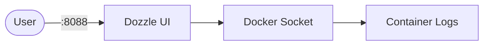

# Dozzle

Dozzle is a lightweight web UI for live container logs.

## How it works



- Image: `amir20/dozzle:latest`
- UI: `http://<host-ip>:8088`
- Socket mapping via `DOZZLE_SOCKET`

## How to run

```bash
cd dozzle
cp .env.example .env
podman compose up -d
```

Socket path options in `.env`:

```env
DOZZLE_SOCKET=/run/podman/podman.sock
```

Docker override:

```env
DOZZLE_SOCKET=/var/run/docker.sock
```

Then run with your engine:

```bash
podman compose up -d
# or
docker compose up -d
```

## References

- Official site: <https://dozzle.dev>
- Documentation: <https://dozzle.dev/guide/getting-started>
- GitHub repo: <https://github.com/amir20/dozzle>
- Docker Hub image: <https://hub.docker.com/r/amir20/dozzle>
- YouTube — The Fastest Way to Debug Docker Containers (Dozzle): <https://www.youtube.com/watch?v=cyNv7UzNaU4>
