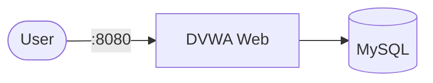

# DVWA (Damn Vulnerable Web App)

DVWA is a PHP/MySQL web application that is damn vulnerable. Its main goals are to be an aid for security professionals to test their skills and tools in a legal environment, to help web developers better understand the processes of securing web applications, and to aid both students and teachers to learn about web application security in a controlled classroom environment.

## How it works



1 The DVWA container and its required MySQL database start.

2. The web interface is exposed on port 8080.

3. The database persists `data` folder.

Stack details in this repo

## Stack details in this repo

- Image: `vulnerables/web-dvwa:latest`
- Container name: `dvwa`
- Ports:
  - `8080` (HTTP)

## How to run

From the repository root:

```bash
docker compose up -d
```

Access the application in your browser:
`http://localhost:8080`

Default credentials: `admin` / `password`

Useful commands:

```bash
docker compose ps
docker compose logs -f
docker compose restart
docker compose down
```

## Notes

- Initialization: Upon first load, you may need to click the "Create / Reset Database" button on the setup page to populate the tables.
- Security: This application is intentionally vulnerable. Do not expose this container to the public internet. It is intended for local educational use only.
- Persistence: This configuration uses a Docker volume for MySQL to ensure your database configuration persists between container restarts.
