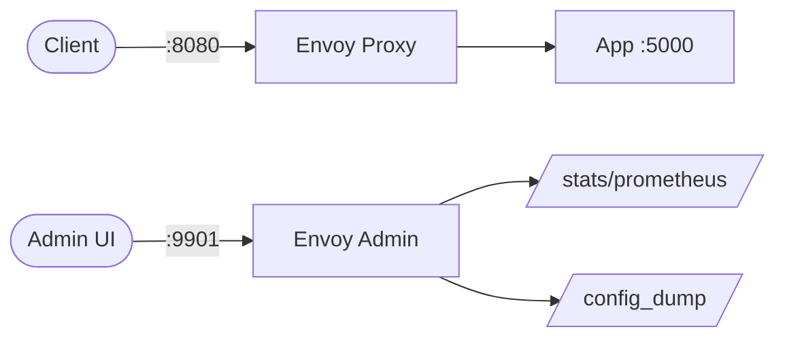

# Envoy

Envoy is a high-performance edge and service proxy designed for cloud-native applications.  
It handles load balancing, observability, and traffic management at L4/L7.

## How Envoy works



1. Envoy listens on configured ports for incoming traffic.
2. Requests are matched against route rules in the listener configuration.
3. Matched traffic is forwarded to upstream clusters using the configured load balancing policy.
4. The admin interface provides stats, config dumps, and health check endpoints.

## Stack details in this repo

- Envoy image: `envoyproxy/envoy:v1.30-latest`
- App image: `ghcr.io/marcuwynu23/express-typescript-sample:latest`
- Container names: `envoy`, `app`
- Proxy port: `8080`
- Admin UI: `http://<host-ip>:9901`
- App internal port: `5000`

## Environment variables

Set via `.env` (copy from `.env.example`):

- `ENVOY_LISTENER_PORT` (default: `8080`)
- `ENVOY_ADMIN_PORT` (default: `9901`)

## How to run

From the repository root:

```bash
cd envoy
cp .env.example .env
docker compose up -d
```

Open:

- Proxy endpoint: `http://localhost:8080`
- Admin UI: `http://localhost:9901`

Useful commands:

```bash
docker compose ps
docker compose logs -f
docker compose restart
docker compose down
```

## Use it effectively

- Edit `envoy/envoy.yaml` to add routes, clusters, and filters for your services.
- Use the admin endpoint `/clusters` to inspect upstream health.
- Add rate limiting, circuit breaking, or retries in the route/cluster config.
- Pair with Prometheus for metrics scraping from the `/stats/prometheus` admin endpoint.

## Notes

- The default config proxies traffic to the `app` container on port `5000`.
- Replace the `app` service image with your own application as needed.
- The admin port should not be exposed publicly in production.
- See [Envoy docs](https://www.envoyproxy.io/docs) for full configuration reference.

## References

- Official site: <https://www.envoyproxy.io>
- Documentation: <https://www.envoyproxy.io/docs>
- GitHub repo: <https://github.com/envoyproxy/envoy>
- Docker Hub image: <https://hub.docker.com/r/envoyproxy/envoy>
- YouTube — Envoy Proxy Crash Course, Architecture, L7 & L4 Proxying, HTTP/2, Enabling TLS 1.2/1.3 and more: <https://www.youtube.com/watch?v=40gKzHQWgP0>
