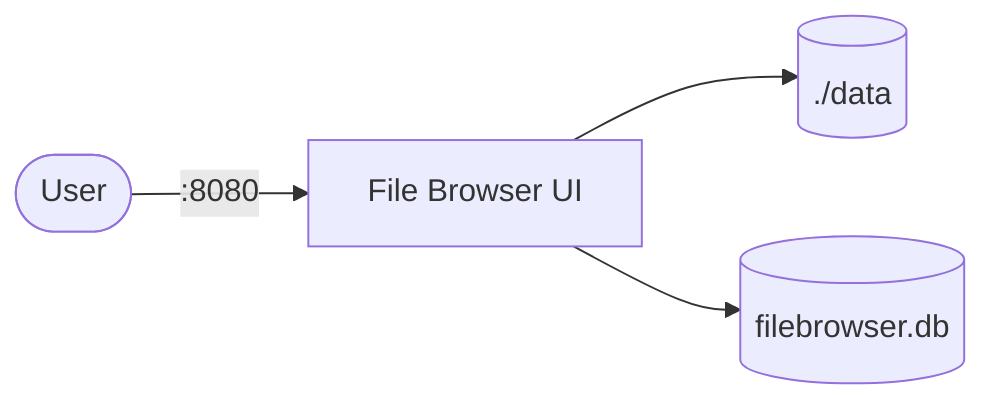

# File Browser

File Browser is a self-hosted web file manager with upload, download, sharing, and editing capabilities.  
It provides a clean UI for managing files on a server without SSH or FTP.

## How File Browser works



1. File Browser starts and serves a web UI on port 80 (mapped to host port 8080).
2. The `./data` directory is exposed as the root file system in the UI.
3. Users can upload, download, rename, move, delete, and edit files from the browser.
4. User accounts and settings are stored in `filebrowser.db`.

## Stack details in this repo

- Image: `filebrowser/filebrowser:latest`
- Container name: `filebrowser`
- Web UI: `http://<host-ip>:8080`
- Persistent data:
  - `./data:/srv` (served files)
  - `filebrowser_db:/database` (user/config database)

## Environment variables

Set via `.env` (copy from `.env.example`):

- `FILEBROWSER_PORT` (default: `8080`)

## How to run

From the repository root:

```bash
cd filebrowser
cp .env.example .env
mkdir -p data
docker compose up -d
```

Open:

- File Browser UI: `http://localhost:8080`

Default credentials:

- Username: `admin`
- Password: `admin`

Change the password on first login.

Useful commands:

```bash
docker compose ps
docker compose logs -f
docker compose restart
docker compose down
```

## Use it effectively

- Place files in `./data/` to make them available in the UI immediately.
- Use the built-in editor for quick text/config file edits.
- Share files via temporary download links from the UI.
- Create additional user accounts with restricted directory access.

## Notes

- Change the default admin password before exposing externally.
- The database is stored in a named Docker volume (`filebrowser_db`).
- Mount any directory you want to manage as `/srv` inside the container.
- See [File Browser docs](https://filebrowser.org/) for full configuration reference.
