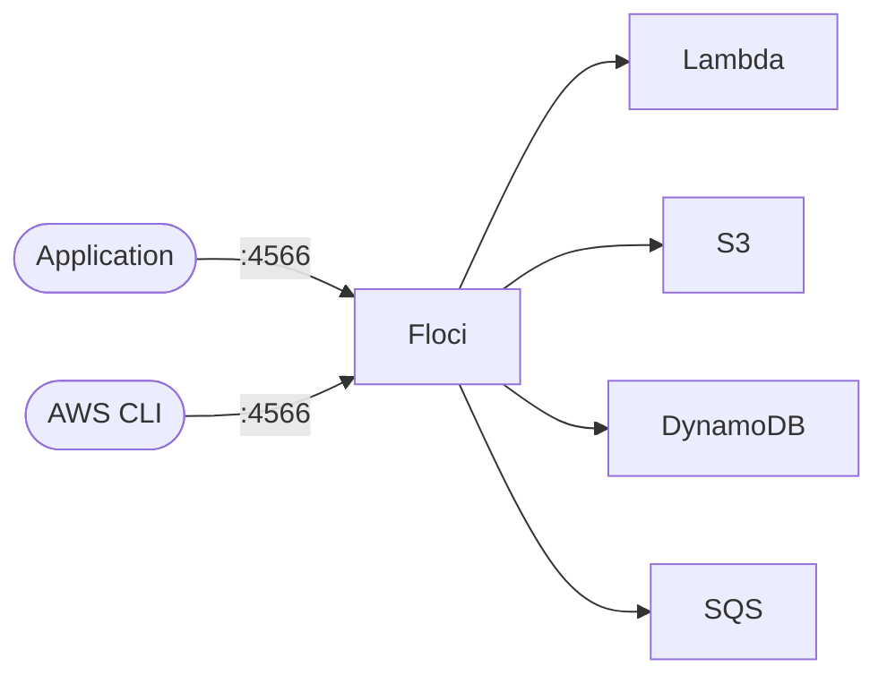

# Floci

Floci is a local cloud development platform that provides AWS-compatible services for local development and testing.  
It allows developers to build and test cloud applications locally without connecting to AWS, supporting services like Lambda, S3, DynamoDB, and more.

## How Floci works



1. Floci emulates AWS services locally using Docker containers.
2. Applications connect to Floci endpoints instead of real AWS services during development.
3. Hot reload capabilities allow for rapid development and testing of Lambda functions.
4. Data persistence through local volumes ensures state is maintained between restarts.

## Stack details in this repo

- Image: `floci/floci:latest`
- Container name: `floci`
- Main port: `4566` (AWS-compatible API endpoint)
- Redis ports: `6379-6399`
- RDS proxy ports: `7001-7099`
- Elasticsearch ports: `9200-9299`
- Web interface: `http://<host-ip>:4566`

## Environment variables

Key configurations in the setup:

- `FLOCI_SERVICES_DOCKER_NETWORK`: Docker network for service communication
- `FLOCI_SERVICES_RDS_PROXY_BASE_PORT`: Base port for RDS proxy services
- `FLOCI_HOSTNAME`: Hostname for the Floci service
- `FLOCI_BASE_URL`: Base URL for API access
- `FLOCI_SERVICES_LAMBDA_HOT_RELOAD_ENABLED`: Enable hot reload for Lambda functions

## How to run

From the repository root:

```bash
cd floci
docker compose up -d
```

Open:

- Floci Dashboard: `http://localhost:4566`
- AWS CLI endpoint: `http://localhost:4566`

Useful commands:

```bash
docker compose ps
docker compose logs -f
docker compose restart
docker compose down
```

## Use it effectively

### AWS CLI Configuration

Configure AWS CLI to use Floci as the endpoint:

```bash
# Set up AWS CLI with dummy credentials
aws configure set aws_access_key_id test
aws configure set aws_secret_access_key test
aws configure set region us-east-1

# Use Floci endpoint for AWS commands
aws --endpoint-url=http://localhost:4566 s3 mb s3://my-test-bucket
aws --endpoint-url=http://localhost:4566 s3 ls
```

### Environment Variables for Applications

Set these environment variables in your applications to use Floci:

```bash
AWS_ENDPOINT_URL=http://localhost:4566
AWS_ACCESS_KEY_ID=test
AWS_SECRET_ACCESS_KEY=test
AWS_DEFAULT_REGION=us-east-1
```

### Supported Services

Floci supports many AWS services including:

- **Lambda** - Serverless functions with hot reload
- **S3** - Object storage
- **DynamoDB** - NoSQL database
- **SQS** - Message queuing
- **SNS** - Notifications
- **CloudFormation** - Infrastructure as code
- **API Gateway** - REST and WebSocket APIs
- **RDS** - Relational databases (via proxy)
- **ElasticSearch** - Search and analytics

### Lambda Development

For Lambda function development with hot reload:

1. Mount your Lambda code directory as a volume
2. Enable hot reload in environment variables (already configured)
3. Deploy functions using AWS CLI or SDKs
4. Changes to code are automatically reflected without redeployment

## Data Persistence

- Local data is stored in `./data` directory
- Data persists between container restarts
- Remove the data directory to reset all services

## Notes

- Floci requires Docker socket access for container management
- Port ranges are configured for multiple service instances
- Network aliases allow services to communicate using `localhost.floci.io`
- Hot reload is enabled for faster Lambda development cycles
- All AWS SDK calls should point to `http://localhost:4566`

## Documentation

For comprehensive documentation, examples, and advanced configuration:

- **Official Documentation**: [https://floci.io/](https://floci.io/)

## Troubleshooting

- Ensure Docker is running and accessible
- Check that required ports are not in use by other services
- Verify Docker socket permissions if container fails to start
- Use `docker compose logs -f` to monitor service startup and errors
