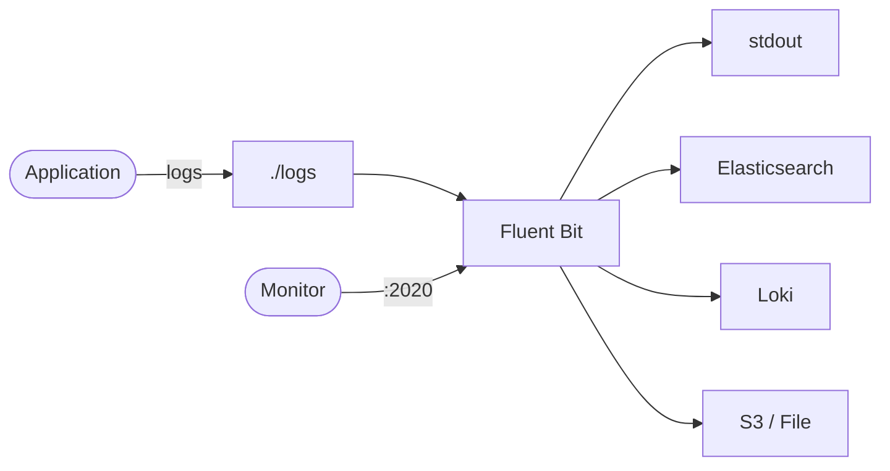

# Fluent Bit

Fluent Bit is a lightweight log processor and forwarder.  
It collects, parses, and routes logs to various destinations (stdout, Elasticsearch, Loki, S3, etc.).

## How Fluent Bit works



1. Applications write log files to a shared volume.
2. Fluent Bit tails log files using the `tail` input plugin.
3. Logs are parsed, filtered, and routed to configured outputs.
4. The built-in HTTP server on port 2020 exposes health and metrics endpoints.

## Stack details in this repo

- Image: `fluent/fluent-bit:latest`
- Container name: `fluent-bit`
- Monitoring port: `2020`
- Config mount: `./fluent-bit/fluent-bit.conf`
- Log input: `./logs` (read-only)

## Environment variables

Set via `.env` (copy from `.env.example`):

- `FLUENTBIT_PORT` (default: `2020`)

## How to run

From the repository root:

```bash
cd fluentbit
cp .env.example .env
mkdir -p logs
docker compose up -d
```

Generate test logs:

```bash
echo '{"time":"2026-05-21T10:00:00.000","level":"info","msg":"hello fluent-bit"}' >> logs/app.log
```

Check health:

```bash
curl http://localhost:2020/api/v1/health
```

View metrics:

```bash
curl http://localhost:2020/api/v1/metrics
```

Useful commands:

```bash
docker compose ps
docker compose logs -f
docker compose restart
docker compose down
```

## Use it effectively

- Edit `fluent-bit/fluent-bit.conf` to add outputs (Elasticsearch, Loki, S3, Kafka, etc.).
- Use filters to enrich, modify, or drop log records before forwarding.
- Mount additional log paths from other containers using shared volumes.
- Pair with Prometheus to scrape the `/api/v1/metrics/prometheus` endpoint.

## Notes

- The default config outputs to stdout for quick testing — add real outputs for production use.
- Fluent Bit is extremely lightweight (~450KB) compared to Fluentd or Logstash.
- Place your application log files in `./logs/` and they will be tailed automatically.
- See [Fluent Bit docs](https://docs.fluentbit.io/) for full plugin and configuration reference.
