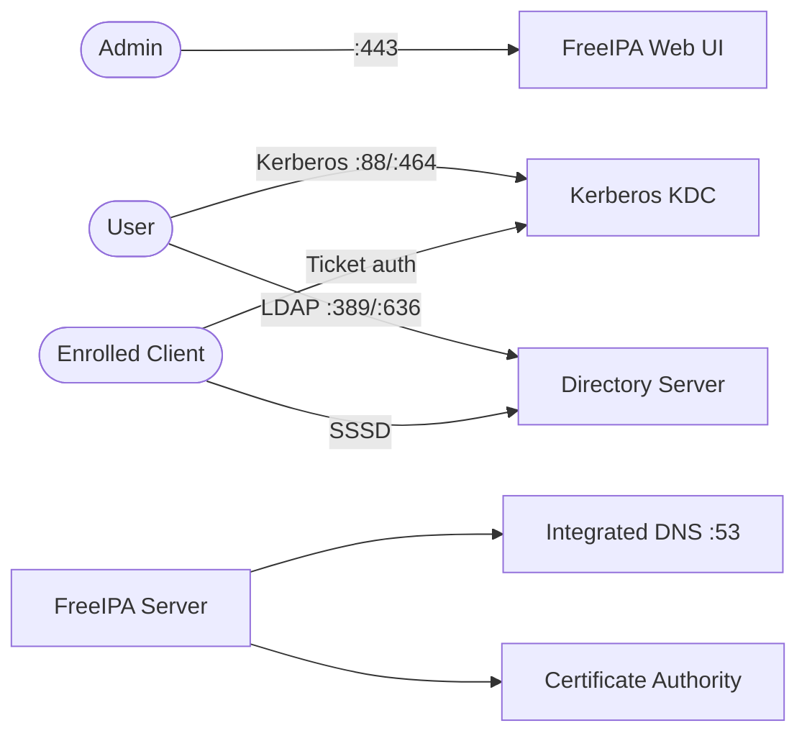

# FreeIPA

FreeIPA is an open-source identity management solution.  
It combines LDAP, Kerberos, DNS, and certificate management into a single platform for centralized authentication, authorization, and host management.

## How FreeIPA works



1. The FreeIPA server starts and runs an unattended `ipa-server-install` on first boot.
2. Directory Server (LDAP on `389`/`636`) stores users, groups, hosts, and policies.
3. Kerberos KDC (`88`, `464`) issues tickets for single sign-on authentication.
4. Integrated DNS (`53/tcp`, `53/udp`) serves the `example.test` zone when `--setup-dns` is used.
5. Admins manage everything through the Web UI (`443`) or the `ipa` CLI inside the container.

## Stack details in this repo

- Image: `freeipa/freeipa-server:almalinux-10`
- Container name: `freeipa`
- Hostname: `ipa.example.test`
- Realm: `EXAMPLE.TEST`
- Domain: `example.test`
- Web UI (HTTPS): `https://<host-ip>`
- Persistent data:
  - `freeipa-data:/data`
  - `/sys/fs/cgroup:/sys/fs/cgroup:rw`
- Exposed ports:
  - `53/tcp`, `53/udp` — DNS
  - `80/tcp` — HTTP (redirects to HTTPS)
  - `443/tcp` — HTTPS Web UI
  - `389/tcp` — LDAP
  - `636/tcp` — LDAPS
  - `88/tcp`, `88/udp` — Kerberos
  - `464/tcp`, `464/udp` — Kerberos password change

## Environment variables

This compose setup does not use a `.env` file by default. Values are set directly in `docker-compose.yml`:

- `TZ` (default in compose: `Asia/Manila`)
- `IPA_SERVER_IP` (default in compose: `no-update`)

> Credentials are passed via the install command in `docker-compose.yml`. Change `--ds-password` and `--admin-password` before first startup.

Default credentials in this repo:

- Admin user: `admin`
- Admin password: `AdminPassword123!`
- Directory Manager password: `DirectoryManagerPassword123!`

## How to run

From the repository root:

```bash
cd freeipa
docker compose up -d
```

Open:

- `https://localhost`

Log in with user `admin` and the admin password from the compose file.

Useful commands:

```bash
docker compose ps          # check container status
docker compose logs -f     # stream logs (first install can take several minutes)
docker compose exec freeipa ipa user-find   # verify IPA is responding
docker compose restart     # restart service
docker compose down        # stop and remove container
```

## Use FreeIPA effectively

- Add `127.0.0.1 ipa.example.test` (or `<host-ip> ipa.example.test`) to your host `hosts` file so the Web UI certificate hostname resolves correctly.
- Use **Users** and **Groups** to centralize login and sudo/HBAC policies.
- Use **Hosts** to enroll Linux clients with `ipa-client-install`.
- Use **DNS Zones** to manage internal records for `example.test`.

## Notes

- First startup runs a full server install and can take several minutes. Wait for logs to settle before logging in.
- Only one DNS service should bind host port `53`. Stop other local DNS servers that use port `53`.
- This stack uses `read_only: true` with `cgroup: host` and a `/sys/fs/cgroup` mount, which FreeIPA requires for systemd-based services inside the container.
- Browser will show a certificate warning on first load because FreeIPA uses its own CA by default.
- Data persists in the `freeipa-data` volume. To reinstall from scratch, run `docker compose down -v`.

## References

- Official site: <https://www.freeipa.org/>
- Documentation: <https://www.freeipa.org/page/Documentation.html>
- Quick Start Guide: <https://www.freeipa.org/page/Quick_Start_Guide>
- FreeIPA in containers: <https://www.freeipa.org/page/Docker>
- Container source (GitHub): <https://github.com/freeipa/freeipa-container>
- Docker Hub image: <https://hub.docker.com/r/freeipa/freeipa-server>
- RHEL 9 Identity Management docs — installing: <https://docs.redhat.com/en/documentation/red_hat_enterprise_linux/9/html-single/installing_identity_management/index>
- RHEL 9 Identity Management docs — users, groups, hosts, access control: <https://docs.redhat.com/en/documentation/red_hat_enterprise_linux/9/html-single/managing_idm_users_groups_hosts_and_access_control_rules/index>
- YouTube — FreeIPA full setup walkthrough (Awesome Open Source): <https://www.youtube.com/watch?v=oYRdeHdErW0>
- YouTube — Identity Management with FreeIPA tutorial (linux.conf.au): <https://www.youtube.com/watch?v=VLhNcirKFDs>
- YouTube — Automating FreeIPA installation (Southeast LinuxFest): <https://www.youtube.com/watch?v=p6EYKIyrE50>
