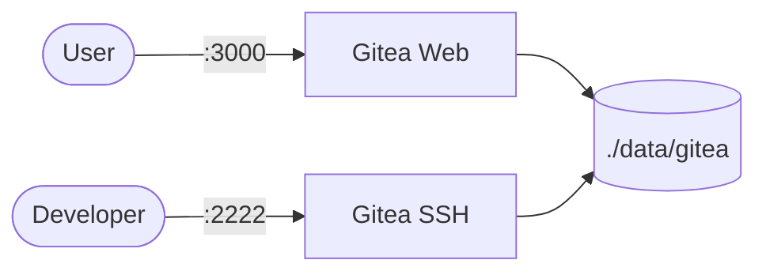

# Gitea

Gitea is a lightweight self-hosted Git service with web UI and SSH access.  
This stack runs a single Gitea server with persistent storage.

## How it works



1. Gitea service starts and exposes web + SSH endpoints.
2. Repository data and configuration are stored under `./data/gitea`.
3. Users interact via browser (UI/API) or git over SSH/HTTP.
4. UID/GID environment values control file ownership compatibility.

## Stack details in this repo

- Image: `gitea/gitea:latest`
- Service/container: `gitea-server` / `gitea`
- Ports:
  - `3000:3000` (web UI)
  - `2222:22` (SSH)
- Persistent data:
  - `./data/gitea:/data`

## Environment variables

Copy `.env.example` to `.env`:

- `USER_UID`
- `USER_GID`

## How to run

From the repository root:

```bash
cd gitea
cp .env.example .env
docker compose up -d
```

Open:

- `http://localhost:3000`

Useful commands:

```bash
docker compose ps
docker compose logs -f
docker compose restart
docker compose down
```

## Notes

- Use `ssh://git@localhost:2222/<owner>/<repo>.git` for SSH clone/push.
- Keep `./data/gitea` backed up for repository persistence.
