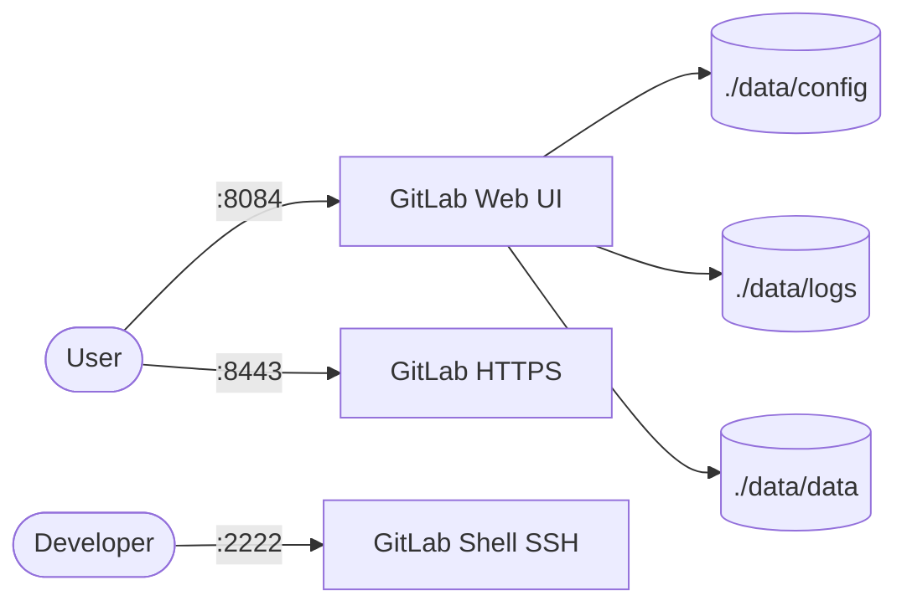

# GitLab

GitLab EE is a self-hosted DevOps platform for Git repository management, code review, CI/CD, and issue tracking.
This stack runs a single GitLab Omnibus server with persistent config, logs, and data.

## How it works



1. GitLab container starts and serves the web UI on port `8084` (HTTP) with HTTPS available on `8443`.
2. Git over SSH is available on port `2222` via GitLab Shell.
3. Omnibus configuration sets `external_url 'http://localhost:8084'` and `gitlab_shell_ssh_port = 2222`.
4. Config, logs, and repositories persist under `./data/config`, `./data/logs`, and `./data/data`.

## Stack details in this repo

- Image: `gitlab/gitlab-ee:latest`
- Container name: `gitlab`
- Hostname: `localhost`
- Ports:
  - `8084:80` (web UI HTTP)
  - `8443:443` (web UI HTTPS)
  - `2222:22` (SSH)
- Persistent data:
  - `./data/config:/etc/gitlab`
  - `./data/logs:/var/log/gitlab`
  - `./data/data:/var/opt/gitlab`
- Other settings:
  - `shm_size: 256m`
  - `restart: unless-stopped`

## Environment variables

Configured directly in `docker-compose.yml` via `GITLAB_OMNIBUS_CONFIG`:

- `external_url 'http://localhost:8084'`
- `gitlab_rails['gitlab_shell_ssh_port'] = 2222`

No `.env` file is required. Change `external_url` if exposing GitLab on a real hostname/IP.

## How to run

From the repository root:

```bash
cd gitlab
docker compose up -d
```

Open:

- `http://localhost:8084`

Get the initial `root` password (auto-generated on first boot, removed after 24h):

```bash
docker exec -it gitlab grep 'Password:' /etc/gitlab/initial_root_password
```

Then log in as `root` with that password and create an admin user / set a new password.

Useful commands:

```bash
docker compose ps
docker compose logs -f
docker compose restart
docker compose down
```

## Use it effectively

- Clone repos via SSH: `git clone ssh://git@localhost:2222/<group>/<project>.git`
- Clone repos via HTTP: `git clone http://localhost:8084/<group>/<project>.git`
- Reset root password if needed:
  ```bash
  docker exec -it gitlab gitlab-rake "gitlab:password:reset[root]"
  ```
- Reconfigure after editing `/etc/gitlab/gitlab.rb` (inside `./data/config/gitlab.rb` on host):
  ```bash
  docker exec -it gitlab gitlab-ctl reconfigure
  ```

## Notes

- First startup can take 5-10 minutes; check `docker compose logs -f` if the UI is not immediately available.
- Allocate at least 4GB RAM — GitLab Omnibus is memory-heavy and will be slow or crash on small hosts.
- This compose uses the EE (`Enterprise Edition`) image; it runs free with CE features unless you add a license.
- Consider pinning the image tag (e.g. `gitlab/gitlab-ee:17.x-ee.0`) for reproducible upgrades instead of `latest`.
- Back up `./data/config`, `./data/data`, and `./data/logs` for full persistence.

## References

- Official site: <https://about.gitlab.com>
- Documentation: <https://docs.gitlab.com>
- Omnibus Docker docs: <https://docs.gitlab.com/omnibus/docker/>
- Docker Hub image: <https://hub.docker.com/r/gitlab/gitlab-ee>

## Self-hosted alternatives in this collection

If GitLab feels too heavy, try a lighter Git host:

- [Gitea](../gitea/) — lightweight self-hosted Git service, low resource use.
- [Bitbucket](../bitbucket/) — Atlassian self-hosted Git with Jira integration.
- [Gitea + Jenkins](../gitea+jenkins/) — lightweight Git + CI/CD combo as a GitLab alternative.
