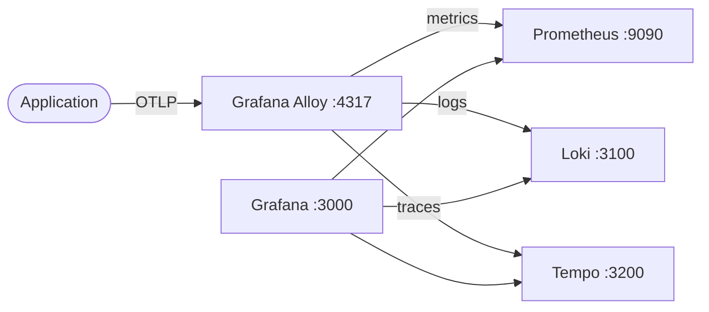

# Grafana Alloy + Prometheus + Loki + Tempo

This stack provides a full observability platform using **Grafana Alloy** as the central telemetry pipeline. Alloy receives OpenTelemetry data from applications and routes metrics to Prometheus, logs to Loki, and traces to Tempo. Grafana visualizes everything in unified dashboards.

> See the [previous version](../grafana-prometheus-loki-opentelemetry-tempo) of this stack using the OpenTelemetry Collector + Promtail instead of Alloy.

## Comparison vs OpenTelemetry Collector + Promtail

| Aspect               | Grafana Alloy (this stack)                          | OpenTelemetry Collector + Promtail                |
| -------------------- | --------------------------------------------------- | ------------------------------------------------- |
| **Agents**           | Single binary for all telemetry                     | Separate agents for traces/metrics + logs         |
| **Log ingestion**    | OTLP logs protocol (app sends logs inline)          | Promtail reads log files from disk                |
| **Config language**  | Alloy / River syntax (`.alloy`)                     | YAML for both OTel Collector and Promtail         |
| **Vendor lock-in**   | Grafana-focused, deeply integrated                  | Vendor-neutral, OTel-native                       |
| **Maturity**         | Newer project, faster evolution                     | Mature ecosystem, broad adoption                  |
| **Pipeline model**   | Unified DAG-based pipeline inside one process       | Two independent pipelines bridged by storage      |
| **Span metrics**     | Requires external configuration or manual scraping  | Built-in `spanmetrics` connector                  |
| **Resource usage**   | One container, less overhead                        | Two containers, slightly more overhead            |

> **When to choose Alloy:** You want a single agent to manage, prefer OTLP log protocol over file scraping, and are already invested in the Grafana ecosystem.
> **When to choose OTel Collector + Promtail:** You need vendor-neutrality, want to read logs from files, or rely on the OTel Collector's span metrics connector.

## How it works



1. The sample application sends OTLP telemetry (metrics, logs, traces) to Grafana Alloy via gRPC.
2. Alloy routes metrics to Prometheus via remote write, logs to Loki via push, and traces to Tempo via OTLP.
3. Prometheus scrapes Alloy's internal metrics and stores time-series data.
4. Grafana auto-loads Prometheus, Loki, and Tempo datasources via provisioning.
5. You query and correlate metrics, logs, and traces in Grafana.

## Stack details in this repo

| Service      | Image                                    | Port(s)                             |
| ------------ | ---------------------------------------- | ----------------------------------- |
| Application  | `ghcr.io/marcuwynu23/express-typescript-sample:latest` | `5000`               |
| Alloy        | `grafana/alloy:latest`                   | `4317`, `4318`, `12345`             |
| Prometheus   | `prom/prometheus:latest`                 | `9090`                              |
| Loki         | `grafana/loki:latest`                    | `3100`                              |
| Tempo        | `grafana/tempo:latest`                   | `3200`                              |
| Grafana      | `grafana/grafana:latest`                 | `3000`                              |

- Persistent data:
  - `prometheus_data:/prometheus`
  - `grafana_data:/var/lib/grafana`
  - `loki_data:/loki`
  - `tempo_data:/var/tempo`
- Mounted config:
  - `./alloy/config.alloy:/etc/alloy/config.alloy`
  - `./prometheus/prometheus.yml:/etc/prometheus/prometheus.yml`
  - `./loki/config.yaml:/etc/loki/config.yaml`
  - `./tempo/config.yaml:/etc/tempo.yaml`
  - `./grafana/provisioning:/etc/grafana/provisioning`

## Environment variables

Configured directly in `docker-compose.yml`:
- `GF_SECURITY_ADMIN_USER` — Grafana admin username (default: `admin`)
- `GF_SECURITY_ADMIN_PASSWORD` — Grafana admin password (default: `admin`)
- `OTEL_EXPORTER_OTLP_ENDPOINT` — OTLP gRPC endpoint for the app (default: `http://alloy:4317`)
- `OTEL_EXPORTER_OTLP_PROTOCOL` — OTLP protocol (default: `grpc`)

## How to run

From the repository root:
```bash
cd grafana-alloy
docker compose up -d
```

Open:
- Grafana: `http://localhost:3000` (login: `admin` / `admin`)
- Prometheus: `http://localhost:9090`
- Loki: `http://localhost:3100`
- Tempo: `http://localhost:3200`
- Application: `http://localhost:5000`

Useful commands:
```bash
docker compose ps
docker compose logs -f
docker compose restart
docker compose down
```

## Link services to the observability pipeline

### Metrics

To send custom application metrics, configure your app to export OTLP metrics to Alloy:
```bash
OTEL_EXPORTER_OTLP_ENDPOINT=http://alloy:4317
OTEL_EXPORTER_OTLP_METRICS_ENDPOINT=http://alloy:4318/v1/metrics
OTEL_EXPORTER_OTLP_PROTOCOL=http/protobuf
```

### Traces

Configure your application to send traces to Alloy via OTLP:
```bash
OTEL_EXPORTER_OTLP_ENDPOINT=http://alloy:4317
OTEL_EXPORTER_OTLP_TRACES_ENDPOINT=http://alloy:4318/v1/traces
OTEL_EXPORTER_OTLP_PROTOCOL=http/protobuf
```

### Logs

To send logs from other services, configure an OTLP logs exporter to point at Alloy:
```bash
OTEL_EXPORTER_OTLP_ENDPOINT=http://alloy:4317
OTEL_EXPORTER_OTLP_LOGS_ENDPOINT=http://alloy:4318/v1/logs
OTEL_EXPORTER_OTLP_PROTOCOL=http/protobuf
```

## Notes

- Change default Grafana credentials before exposing this stack externally.
- Grafana Alloy acts as a single OTLP ingestion point replacing the need for separate collectors.
- Alloy scrapes its own metrics on port `12345` for Prometheus to collect.
- Restart services after config changes:
```bash
docker compose restart alloy   # After config.alloy changes
docker compose restart prometheus   # After prometheus.yml changes
docker compose restart loki   # After loki config.yaml changes
docker compose restart tempo   # After tempo config.yaml changes
```
