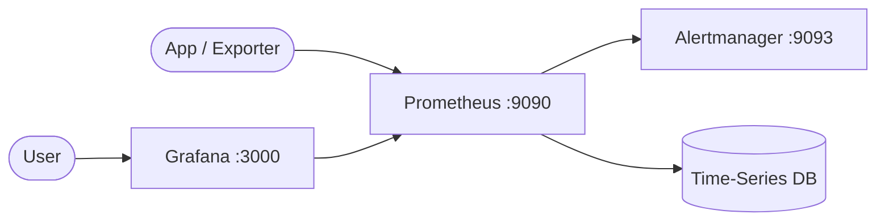

# Grafana + Prometheus + AlertManager

This stack provides basic monitoring and visualization using Prometheus and Grafana.  
Prometheus collects metrics and Grafana renders dashboards from Prometheus data.

## How it works



1. Prometheus starts with local scrape config from `prometheus/prometheus.yml`.

````

Open:

- Prometheus: `http://localhost:9090`
- Grafana: `http://localhost:3000`

Useful commands:

```bash
docker compose ps
docker compose logs -f
docker compose restart
docker compose down
````

## Link app server metrics

To scrape metrics from your app server, add a target in `prometheus/prometheus.yml`:

```yaml
- job_name: "api-server"
  static_configs:
    - targets: ["api-server:8080"]
```

Guidelines:

- Ensure your app exposes a Prometheus endpoint (typically `/metrics`).
- If your app is in Docker Compose, use the service name and container port (for example `api-server:8080`).
- If your app runs outside Docker, use a reachable host/IP and port.
- Restart Prometheus after config changes:

```bash
docker compose restart prometheus
```

## Notes

- Change default Grafana credentials before exposing this stack.
- You can add additional scrape targets in `prometheus/prometheus.yml`.
