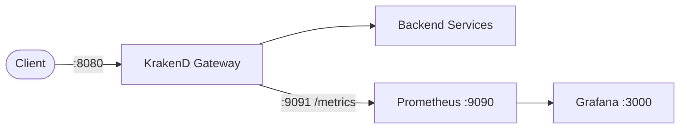

# Grafana + Prometheus + KrakenD API Gateway

This stack provides a production-ready API Gateway using KrakenD with observability via Prometheus and Grafana.

---

## How it works



1. KrakenD runs as a stateless API Gateway
2. Routes requests to backend services
3. Exposes metrics at `/metrics` on port `9091`
4. Prometheus scrapes metrics from KrakenD
5. Grafana visualizes collected metrics

---

## Architecture Overview

```
KrakenD (8080)
   |
   |--> Metrics (/metrics:9091)
   |
Prometheus (9090)
   |
Grafana (3000)
```

---

## Services

- KrakenD API Gateway
- Prometheus Metrics Collector
- Grafana Dashboard

---

## Ports

| Service     | URL                                                            |
| ----------- | -------------------------------------------------------------- |
| KrakenD API | [http://localhost:8080](http://localhost:8080)                 |
| Metrics     | [http://localhost:9091/metrics](http://localhost:9091/metrics) |
| Prometheus  | [http://localhost:9090](http://localhost:9090)                 |
| Grafana     | [http://localhost:3000](http://localhost:3000)                 |

---

## KrakenD Configuration (IMPORTANT)

Metrics are exposed using OpenTelemetry Prometheus exporter:

```json
"extra_config": {
  "telemetry/logging": {
    "level": "INFO",
    "prefix": "[KRAKEND]",
    "stdout": true
  },

  "telemetry/opentelemetry": {
    "service_name": "krakend-gateway",
    "exporters": {
      "prometheus": [
        {
          "name": "local_prometheus",
          "port": 9091,
          "process_metrics": true,
          "go_metrics": true
        }
      ]
    }
  }
}
```

---

## Prometheus Configuration

```yaml
global:
  scrape_interval: 15s
  evaluation_interval: 15s

scrape_configs:
  - job_name: "prometheus"
    static_configs:
      - targets: ["prometheus:9090"]

  - job_name: "krakend"
    static_configs:
      - targets: ["krakend:9091"]
```

---

## Docker Compose

```yaml
version: "3.9"

services:
  krakend:
    image: devopsfaith/krakend:latest
    container_name: krakend
    restart: unless-stopped
    ports:
      - "8080:8080"
      - "9091:9091"
    volumes:
      - ./data/krakend.json:/etc/krakend/krakend.json:ro
    command: ["run", "-c", "/etc/krakend/krakend.json"]
    networks:
      - monitoring

  prometheus:
    image: prom/prometheus:latest
    container_name: prometheus
    restart: always
    ports:
      - "9090:9090"
    volumes:
      - ./prometheus/prometheus.yml:/etc/prometheus/prometheus.yml:ro
      - prometheus_data:/prometheus
    command:
      - "--config.file=/etc/prometheus/prometheus.yml"
      - "--storage.tsdb.path=/prometheus"
    networks:
      - monitoring

  grafana:
    image: grafana/grafana:latest
    container_name: grafana
    restart: always
    ports:
      - "3000:3000"
    environment:
      GF_SECURITY_ADMIN_USER: admin
      GF_SECURITY_ADMIN_PASSWORD: admin
    volumes:
      - grafana_data:/var/lib/grafana
    depends_on:
      - prometheus
    networks:
      - monitoring

volumes:
  prometheus_data:
  grafana_data:

networks:
  monitoring:
    driver: bridge
```

---

## Key Endpoints

### KrakenD API

```
http://localhost:8080/github/user
```

### Metrics Endpoint

```
http://localhost:9091/metrics
```

---

## Validation Steps

### 1. Check KrakenD API

```bash
curl http://localhost:8080/github/user
```

### 2. Check Metrics

```bash
curl http://localhost:9091/metrics
```

### 3. Check Prometheus Targets

```
http://localhost:9090/targets
```

---

## Notes

- `/metrics` is exposed by KrakenD via OpenTelemetry Prometheus exporter
- No need for json-exporter anymore
- Prometheus scrapes directly from KrakenD
- Ensure port `9091` is exposed in Docker

---

## Recommended Improvements

- Add Alertmanager for alerting
- Add Loki for logs
- Add distributed tracing via OTEL Collector
- Add Kubernetes Helm deployment

---

## Summary

✔ Direct Prometheus scraping from KrakenD
✔ No JSON exporter required
✔ OpenTelemetry-based metrics pipeline
✔ Simplified architecture
