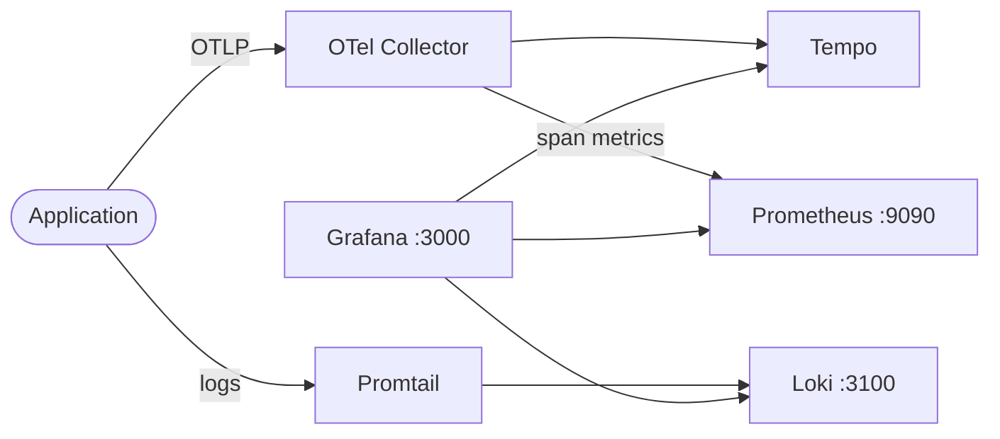

# Prometheus + Grafana + Loki + OpenTelemetry + Tempo

This stack provides a full observability platform combining metrics, logs, and traces.  
Prometheus collects metrics, Loki aggregates logs, Tempo stores traces, OpenTelemetry collects and routes telemetry data, and Grafana visualizes everything in unified dashboards.

## How it works



1. The sample application sends traces to the OpenTelemetry Collector via OTLP.
2. OpenTelemetry Collector processes traces and exports them to Tempo, while generating span metrics for Prometheus.
3. Promtail reads application log files and pushes them to Loki.
4. Prometheus scrapes metrics from the OpenTelemetry Collector and the application.
5. Grafana auto-loads Prometheus, Loki, and Tempo datasources via provisioning.
6. You query and correlate metrics, logs, and traces in Grafana dashboards.

## Stack details in this repo

| Service                 | Image                                                  | Port(s)                |
| ----------------------- | ------------------------------------------------------ | ---------------------- |
| Application             | `ghcr.io/marcuwynu23/express-typescript-sample:latest` | `5000`                 |
| Prometheus              | `prom/prometheus:latest`                               | `9090`                 |
| Grafana                 | `grafana/grafana:latest`                               | `3000`                 |
| Loki                    | `grafana/loki:2.9.8`                                   | `3100`                 |
| Promtail                | `grafana/promtail:2.9.8`                               | —                      |
| OpenTelemetry Collector | `otel/opentelemetry-collector-contrib:latest`          | `4317`, `4318`, `8889` |
| Tempo                   | `grafana/tempo:latest`                                 | `3200`                 |

- Persistent data:
  - `prometheus_data:/prometheus`
  - `grafana_data:/var/lib/grafana`
  - `loki_data:/loki`
  - `tempo_data:/tmp/tempo`
  - `express-logs:/var/log/express`
- Mounted config:
  - `./prometheus/prometheus.yaml:/etc/prometheus/prometheus.yml`
  - `./grafana/provisioning:/etc/grafana/provisioning`
  - `./loki/loki-config.yml:/etc/loki/loki-config.yml`
  - `./promtail/promtail-config.yml:/etc/promtail/promtail-config.yml`
  - `./opentelemetry/otel-config.yaml:/etc/otel-collector-config.yaml`
  - `./tempo/tempo.yaml:/etc/tempo.yaml`

## Environment variables

Configured directly in `docker-compose.yml`:

- `GF_SECURITY_ADMIN_USER` — Grafana admin username (default: `admin`)
- `GF_SECURITY_ADMIN_PASSWORD` — Grafana admin password (default: `admin`)
- `LOKI_PORT` — Loki HTTP port (default: `3100`)
- `OPENTELEMETRY_URL` — OTel Collector gRPC endpoint for the app
- `OTEL_EXPORTER_OTLP_ENDPOINT` — OTel Collector HTTP endpoint for the app
- `OTEL_EXPORTER_OTLP_PROTOCOL` — OTLP export protocol (`http/protobuf`)

## How to run

From the repository root:

```bash
cd grafana-prometheus-loki-opentelemetry-tempo
docker compose up -d
```

Open:

- Grafana: `http://localhost:3000` (login: `admin` / `admin`)
- Prometheus: `http://localhost:9090`
- Loki: `http://localhost:3100`
- Tempo: `http://localhost:3200`
- Application: `http://localhost:5000`

Useful commands:

```bash
docker compose ps
docker compose logs -f
docker compose restart
docker compose down
```

## Link app server metrics and traces

### Metrics

To scrape metrics from your app, add a target in `prometheus/prometheus.yaml`:

```yaml
- job_name: "my-service"
  static_configs:
    - targets: ["my-service:8080"]
```

### Traces

Configure your application to send traces to the OpenTelemetry Collector:

```bash
OTEL_EXPORTER_OTLP_ENDPOINT=http://otel-collector:4318
OTEL_EXPORTER_OTLP_TRACES_ENDPOINT=http://otel-collector:4318/v1/traces
OTEL_EXPORTER_OTLP_PROTOCOL=http/protobuf
```

### Logs

To collect logs from another service, add a scrape config in `promtail/promtail-config.yml`:

```yaml
- job_name: my-service-logs
  static_configs:
    - targets: [localhost]
      labels:
        job: my-service
        __path__: /var/log/my-service/*.log
```

Mount the log volume into the Promtail container and restart:

```bash
docker compose restart promtail
```

## Architecture overview

```
┌─────────────┐         ┌──────────────────────┐
│ Application │──traces──▶ OpenTelemetry        │
│  (Express)  │         │ Collector             │
└──────┬──────┘         └───┬──────────┬────────┘
       │                    │          │
       │ logs          traces│     span metrics
       ▼                    ▼          ▼
┌──────────────┐    ┌───────────┐  ┌────────────┐
│   Promtail   │    │   Tempo   │  │ Prometheus │
└──────┬───────┘    └─────┬─────┘  └─────┬──────┘
       │                  │               │
       ▼                  ▼               ▼
┌──────────────┐    ┌─────────────────────────────┐
│     Loki     │    │           Grafana            │
└──────┬───────┘    │  (Prometheus + Loki + Tempo) │
       │            └──────────────────────────────┘
       └──────────────────────▲
```

## Notes

- Change default Grafana credentials before exposing this stack externally.
- Prometheus scrapes the OTel Collector on port `8889` for span-derived metrics.
- Loki uses filesystem storage with TSDB schema — suitable for development and small deployments.
- Tempo stores traces locally — for production, consider object storage backends.
- The OpenTelemetry Collector uses `spanmetrics` connector to derive RED metrics from traces.
- Restart services after config changes:

```bash
docker compose restart prometheus   # After prometheus.yaml changes
docker compose restart promtail     # After promtail-config.yml changes
docker compose restart otel-collector  # After otel-config.yaml changes
```
