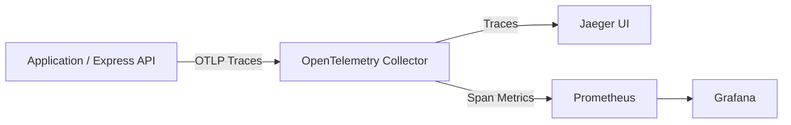

# Grafana + Prometheus + OpenTelemetry + Jaeger UI

This project runs a minimal **full observability stack** with:

- OpenTelemetry Collector (traces + span metrics)
- Prometheus (metrics storage)
- Jaeger UI (distributed tracing + service monitoring)
- Grafana (visualization layer)

---

# What Each Component Does

## OpenTelemetry Collector

- Receives OTLP traces on `4317`
- Converts traces → metrics using `spanmetrics`
- Exposes Prometheus metrics on `8889`
- Forwards traces to Jaeger

---

## Prometheus

- Scrapes metrics from:
  - `otel-collector:8889`

- Stores time-series metrics
- Backend for Grafana dashboards
- Backend for Jaeger SPM (Service Performance Monitoring)

---

## Jaeger UI

- Trace exploration UI:
  [http://localhost:16686](http://localhost:16686)
- Shows:
  - request traces
  - latency breakdown
  - service dependencies

- Monitor tab uses Prometheus metrics for SPM

---

## Grafana

- Visualization layer for metrics
- Connects to Prometheus datasource
- Provides dashboards for:
  - service latency
  - error rate
  - throughput (RPS)
  - span metrics (RED metrics)

### Recommended Dashboard

Use Grafana dashboard:

Dashboard ID: 19419

Import steps:

1. Open Grafana: [http://localhost:3000](http://localhost:3000)
2. Login
3. Go to Dashboards → Import
4. Enter ID: 19419
5. Select Prometheus datasource
6. Click Import

---

# Architecture Flow

---

# Services and Ports

| Service        | Port  | Description          |
| -------------- | ----- | -------------------- |
| otel-collector | 4317  | OTLP trace ingestion |
| otel-collector | 8889  | Prometheus metrics   |
| prometheus     | 9090  | Metrics UI/API       |
| jaeger         | 16686 | Trace UI             |
| grafana        | 3000  | Dashboard UI         |

---

# Run

podman compose up -d --remove-orphans

---

# Verify Services

## Check containers

podman compose ps

---

## Open UIs

- Jaeger: [http://localhost:16686](http://localhost:16686)
- Prometheus: [http://localhost:9090](http://localhost:9090)
- Grafana: [http://localhost:3000](http://localhost:3000)

---

# Prometheus Queries (Useful)

up{job="otel-collector"}

sum(rate(traces_span_metrics_duration_milliseconds_count[5m])) by (service_name)

histogram_quantile(0.95,
sum(rate(traces_span_metrics_duration_milliseconds_bucket[5m])) by (le, service_name)
)

---

# Jaeger Queries

- Service: otel-demo
- View traces in Search tab
- Monitor tab shows SPM metrics

---

# Notes

- spanmetrics may take 30–90 seconds to appear
- Grafana requires Prometheus datasource configured
- SELinux systems may require :Z volume flag

---

# Optional Improvements

You can extend this stack with:

- Loki (logs)
- Promtail (log shipping)
- Pino traceId correlation
- Alertmanager (alerts)
- Kubernetes deployment version
