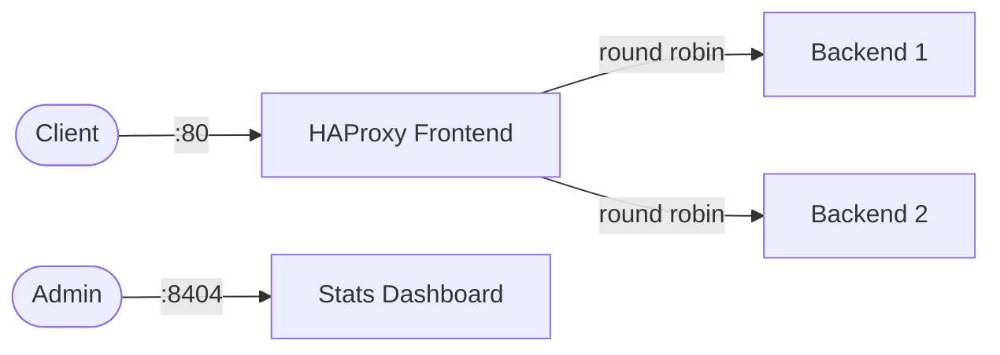

# HAProxy

HAProxy is a high-performance TCP/HTTP load balancer and reverse proxy.  
It provides advanced load balancing, health checking, and a built-in stats dashboard.

## How HAProxy works



1. HAProxy listens on the frontend port and accepts incoming connections.
2. Requests are distributed to backend servers using the configured balancing algorithm.
3. Health checks monitor backend availability and remove unhealthy servers.
4. The stats page provides real-time metrics on connections, throughput, and server health.

## Stack details in this repo

- Image: `haproxy:2.9-alpine`
- Container name: `haproxy`
- HTTP port: `80`
- Stats dashboard: `http://<host-ip>:8404/stats`
- Config: `./haproxy/haproxy.cfg`

## Environment variables

Set via `.env` (copy from `.env.example`):

- `HAPROXY_HTTP_PORT` (default: `80`)
- `HAPROXY_STATS_PORT` (default: `8404`)

## How to run

From the repository root:

```bash
cd haproxy
cp .env.example .env
docker compose up -d
```

Open:

- Stats: `http://localhost:8404/stats`

Useful commands:

```bash
docker compose ps
docker compose logs -f
docker compose restart
docker compose down
```

## Use it effectively

- Edit `haproxy/haproxy.cfg` to add backend servers and configure balancing algorithms.
- Use `balance leastconn` for long-lived connections or `balance roundrobin` for even distribution.
- Add health checks with `check inter 5s fall 3 rise 2` on server lines.
- Enable SSL termination by adding `bind *:443 ssl crt /etc/haproxy/certs/` to the frontend.

## Notes

- The default config proxies to `host.docker.internal:8080` — update backend servers to match your setup.
- Stats page has no authentication by default; add `stats auth user:pass` for production.
- See [HAProxy docs](https://www.haproxy.org/download/2.9/doc/configuration.txt) for full configuration reference.
