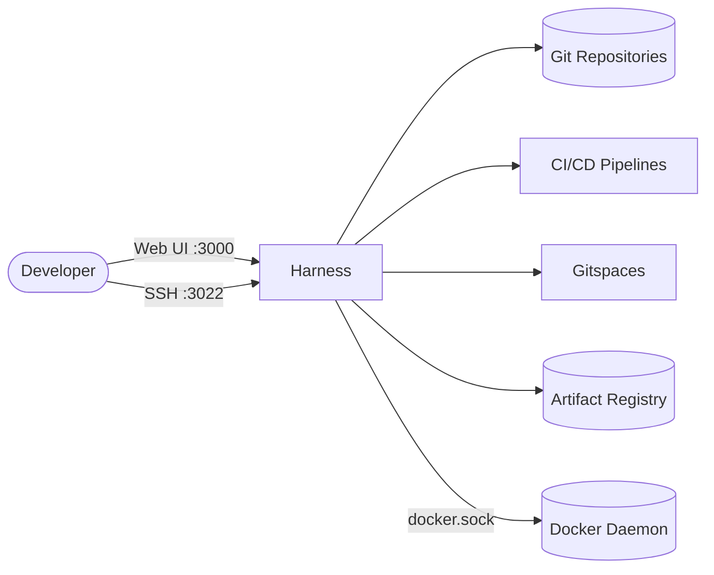

# Harness

Harness Open Source (formerly Gitness) is an end-to-end developer platform with
Source Control Management, CI/CD pipelines, hosted developer environments
(Gitspaces), and artifact registries — all in a single container.

## How Harness works



1. Developers use the web UI on port 3000 and clone/push over SSH on port 3022.
2. Repositories, the SQLite database, and the registry are stored under `/data`.
3. CI pipelines and Gitspaces run containers through the host Docker socket.

## Stack details in this repo

- Service: `harness`
- Image: `docker.io/harness/harness:latest`
- Container name: `harness`
- Web UI: `http://<host-ip>:3000`
- SSH git port: `<host-ip>:3022`
- Persistent data:
  - `harness-data:/data` (database, git repositories, registry)
- Docker socket: `/var/run/docker.sock` mounted for pipelines and Gitspaces

## Environment variables

The stack runs without environment variables by default. Optional variables:

- `GITNESS_PRINCIPAL_ADMIN_EMAIL` / `GITNESS_PRINCIPAL_ADMIN_PASSWORD` — pre-create the admin account
- `GITNESS_USER_SIGNUP_ENABLED` — set to `false` to disable public signups
- `GITNESS_DOCKER_HOST` — alternate Docker socket path (e.g. Rancher Desktop, Colima)
- `GITNESS_HTTP_PORT` (default: `3000`) — HTTP listen port
- `GITNESS_SSH_ENABLE` / `GITNESS_GITSPACE_ENABLE` — toggle SSH and Gitspaces

Add them under `environment:` in `docker-compose.yml` when needed.

## How to run

From the repository root:

```bash
cd harness
docker compose up -d
```

Open `http://localhost:3000` in your browser, sign up, and create your first repository.

Useful commands:

```bash
docker compose ps
docker compose logs -f
docker compose restart
docker compose down
```

## Use it effectively

- The first signed-up user becomes the admin; set `GITNESS_USER_SIGNUP_ENABLED=false`
  afterwards to close public registration.
- Clone and push over SSH on port 3022:

  ```bash
  git clone ssh://git@localhost:3022/<namespace>/<repo>
  ```

- CI pipeline steps execute build containers on the host Docker daemon via the
  mounted socket.
- Open a Gitspace from a repository to get a hosted cloud development environment.

## Notes

- `/data` holds the database and repositories — back up the `harness-data` volume
  regularly. To match the official `docker run` command with a bind mount, replace
  the named volume with `./harness:/data` (or `/tmp/harness:/data`).
- Mounting the Docker socket gives the container root-level access to the host —
  only run this on trusted hosts.
- On Docker Desktop, `/var/run/docker.sock` works by default; on Rancher Desktop
  or Colima, create a symlink to the socket or set `GITNESS_DOCKER_HOST`.
- See the [Harness Open Source docs](https://developer.harness.io/docs/open-source/)
  for full configuration details.

## References

- Documentation: <https://developer.harness.io/docs/open-source/>
- GitHub repo: <https://github.com/harness/harness>
- Docker Hub image: <https://hub.docker.com/r/harness/harness>
