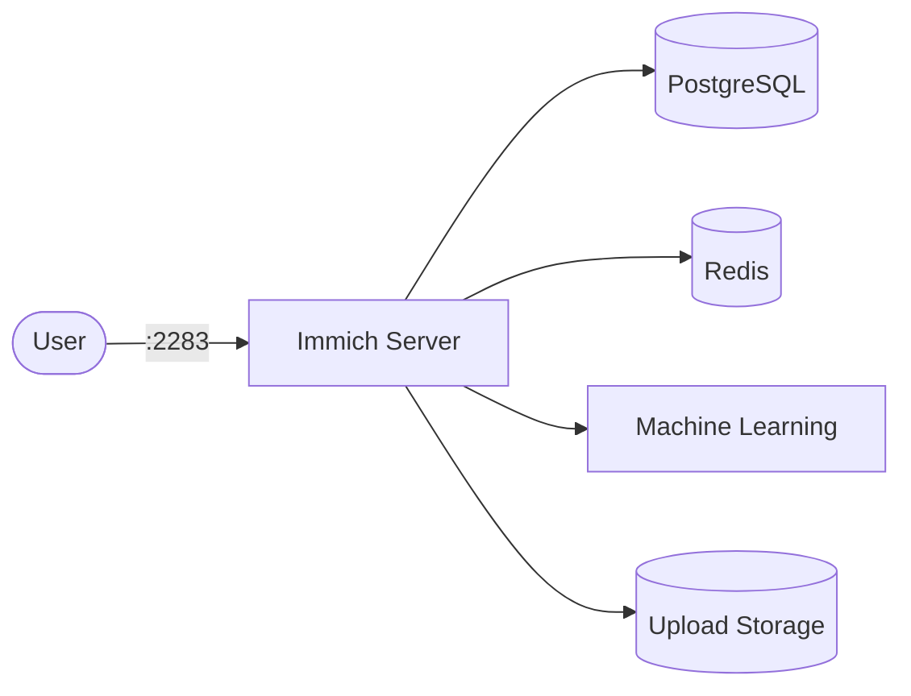

# Immich

Immich is a self-hosted photo and video backup solution. It provides a modern web UI and mobile apps for browsing, organizing, and backing up your media library.

## How Immich works



1. The Immich server exposes a REST API and web UI on port 2283.
2. Media files are uploaded and stored on the mounted upload volume.
3. PostgreSQL stores metadata, user data, and album information.
4. Redis handles caching and background job queues.
5. The machine learning service provides face recognition and smart search.

## Stack details in this repo

- Image: `ghcr.io/immich-app/immich-server:release`
- Machine learning image: `ghcr.io/immich-app/immich-machine-learning:release`
- Database image: `docker.io/tensorchord/pgvecto-rs:pg14-v0.2.0`
- Redis image: `docker.io/redis:6.2-alpine`
- Container names: `immich_server`, `immich_machine_learning`, `immich_redis`, `immich_postgres`
- Port: `2283`
- Persistent volumes:
  - `pgdata` — PostgreSQL data
  - `model-cache` — ML model cache
- Upload location: `${UPLOAD_LOCATION}` mounted at `/usr/src/app/upload`

## Environment variables

Set via `.env` (create one in the stack directory):

- `UPLOAD_LOCATION` — path to store uploaded media (e.g. `./library`)
- `DB_PASSWORD` — PostgreSQL password
- `DB_USERNAME` — PostgreSQL username (default: `postgres`)
- `DB_DATABASE` — PostgreSQL database name (default: `immich`)

## How to run

From the repository root:

```bash
cd immich
cp .env.example .env   # or create .env manually
docker compose up -d
```

Open:

- Web UI: `http://localhost:2283`

Useful commands:

```bash
docker compose ps
docker compose logs -f
docker compose restart
docker compose down
```

## Use it effectively

- Upload photos and videos via the web UI or mobile apps.
- Enable face recognition in settings to group photos by person.
- Use albums and shared links to organize and share media.
- Set up automatic backup from your phone using the Immich mobile app.

## Notes

- The `pgvecto-rs` image is required for vector similarity search (smart search).
- First startup may take a few minutes as database migrations run.
- For production, configure a reverse proxy with TLS in front of Immich.
- Regularly back up both the upload directory and the PostgreSQL volume.

## References

- Official site: <https://immich.app>
- Documentation: <https://immich.app/docs/overview>
- GitHub repo: <https://github.com/immich-app/immich>
- Docker Hub image: <https://github.com/immich-app/immich/pkgs/container/immich-server>
