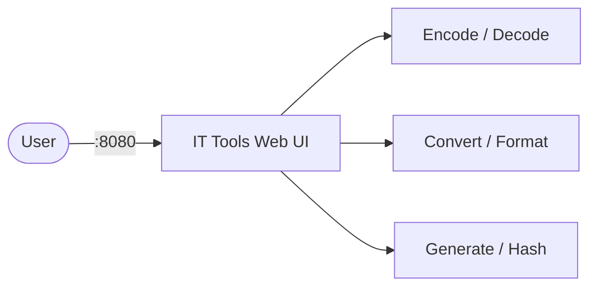

# IT Tools

IT Tools is a self-hosted collection of handy developer utilities accessible from a single web UI.  
It includes encoders/decoders, converters, generators, formatters, and network tools — all running locally.

## How IT Tools works



1. IT Tools starts a lightweight web server serving the tool collection.
2. Users access the UI in a browser — all processing happens client-side.
3. No data leaves the container; everything runs locally.
4. Tools include Base64, JWT decode, UUID generator, hash functions, cron parser, regex tester, and many more.

## Stack details in this repo

- Image: `ghcr.io/corentinth/it-tools:latest`
- Container name: `it-tools`
- Web UI: `http://<host-ip>:8080`

## How to run

From the repository root:

```bash
cd it-tools
docker compose up -d
```

Open:

- IT Tools UI: `http://localhost:8080`

Useful commands:

```bash
docker compose ps
docker compose logs -f
docker compose restart
docker compose down
```

## Use it effectively

- Bookmark frequently used tools (UUID generator, JSON formatter, Base64 encoder).
- Use the search bar to quickly find tools by name or category.
- Share the instance with your team as an internal utility dashboard.
- No login required — the UI is open by default.

## Notes

- All processing is client-side; no data is sent to external servers.
- The container is stateless — no persistent volume needed.
- Change the host port mapping if `8080` conflicts with other services.
- See [IT Tools GitHub](https://github.com/CorentinTh/it-tools) for the full list of included utilities.
