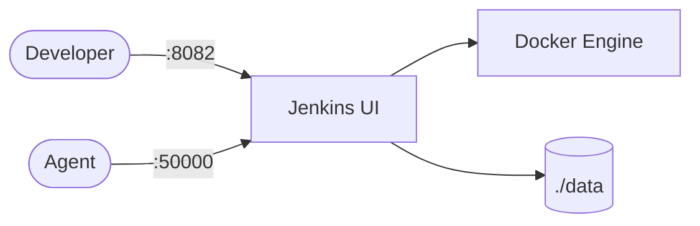

# Jenkins

Jenkins is a self-hosted automation server for CI/CD pipelines.  
This setup runs a Jenkins controller with persistent home data and Docker access.

## How it works



1. Jenkins container starts and serves the web UI.
2. Pipeline/job configuration is stored in mounted `./data`.
3. Jenkins can run Docker-based builds through mounted `docker.sock`.
4. Plugin bootstrap can use `plugins.txt` mounted read-only.

## Stack details in this repo

- Image: `jenkins/jenkins:latest-jdk21`
- Container name: `jenkins`
- Ports:
  - `8082:8080` (web UI)
  - `50000:50000` (agent port)
- Persistent data:
  - `./data:/var/jenkins_home`
- Additional mounts:
  - `./plugins.txt:/usr/share/jenkins/ref/plugins.txt:ro`
  - `/var/run/docker.sock:/var/run/docker.sock`
  - `/usr/bin/docker:/usr/bin/docker`

## Environment variables

Current compose includes:

- `JAVA_OPTS=-Djenkins.install.runSetupWizard=false`
- `TZ=Asia/Manila`

`.env.example` exists if you want to externalize values.

## How to run

From the repository root:

```bash
cd jenkins
docker compose up -d
```

Open:

- `http://localhost:8082`

Useful commands:

```bash
docker compose ps
docker compose logs -f
docker compose restart
docker compose down
```

## Notes

- Mounting Docker socket gives Jenkins strong control of host Docker.
- Consider pinning Jenkins/plugin versions for reproducible CI environments.
