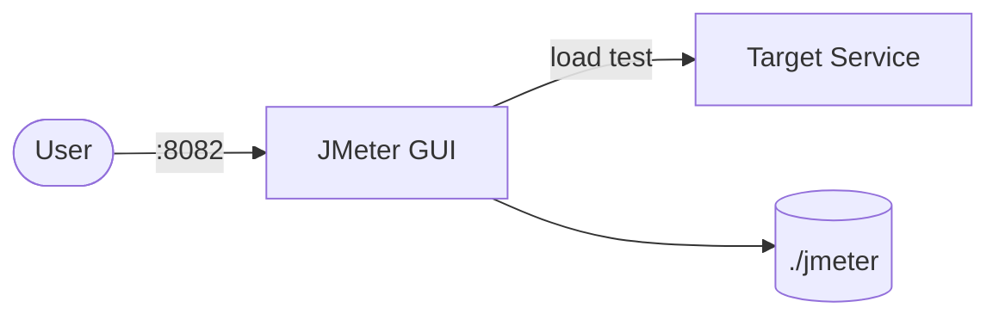

# JMeter GUI

Apache JMeter with a web-based GUI for designing and running load tests.  
This stack runs JMeter in GUI mode using Docker Compose.

## How it works



1. Start the container and access the JMeter GUI at `http://localhost:8082`.
2. The `./jmeter` folder is mounted as `/root/jmeter` inside the container.
3. Place or edit your JMeter test plans (`.jmx`) in the `./jmeter` folder.
4. Use the web interface to configure, run, and inspect test results directly.

## Stack details in this repo

- Image: `guitarrapc/jmeter-gui:5.6.3`
- Container name: `jmeter-gui`
- Mounted folders:
  - `./jmeter:/root/jmeter` (test plans and config)
- Default port: `8082:8080`

## How to run

From the repository root:

```bash
cd jmeter-gui
docker compose up -d
```

If you use Podman:

```bash
cd jmeter-gui
podman compose up -d
```

Open the GUI in your browser:

```
http://localhost:8082
```

## Running tests

All test execution is done through the JMeter web GUI. Once the container is running:

1. Open `http://localhost:8082` in your browser.
2. Load or create a `.jmx` test plan from the `./jmeter` folder.
3. Configure your target and thread groups in the GUI.
4. Click **Start** to run the test — results are viewable directly in the interface.

## Creating JMX test plans

### Through the web GUI

1. Open `http://localhost:8082`.
2. Click **File** → **New** to create a blank test plan.
3. Add elements from the **Options** or **Elements** menu:
   - **Thread Group** — defines virtual users, ramp-up, and loop count.
   - **HTTP Request** — configures the target URL, method, and parameters.
   - **Listener** — adds result visualizations (e.g., View Results Tree, Summary Report).
4. Click **Save** to store the `.jmx` file in `./jmeter/`.

### Basic JMX structure

A `.jmx` file is an XML document. A minimal test plan contains:

```xml
<?xml version="1.0" encoding="UTF-8"?>
<jmeterTestPlan version="1.2" properties="5.0">
  <hashTree>
    <TestPlan guiclass="TestPlanGui" testclass="TestPlan">
      <stringProp name="TestPlan.comments"></stringProp>
      <boolProp name="TestPlan.functional_mode">false</boolProp>
      <boolProp name="TestPlan.tearDown_on_shutdown">true</boolProp>
      <elementProp name="TestPlan.user_defined_variables" elementType="Arguments">
        <collectionProp name="Arguments.arguments"/>
      </elementProp>
      <stringProp name="TestPlan.user_define_classpath"></stringProp>
    </TestPlan>
    <hashTree>
      <ThreadGroup guiclass="ThreadGroupGui" testclass="ThreadGroup">
        <stringProp name="ThreadGroup.on_sample_error">continue</stringProp>
        <elementProp name="ThreadGroup.main_controller" elementType="LoopController">
          <boolProp name="LoopController.continue_forever">false</boolProp>
          <stringProp name="LoopController.loops">1</stringProp>
        </elementProp>
        <stringProp name="ThreadGroup.num_threads">1</stringProp>
        <stringProp name="ThreadGroup.ramp_time">1</stringProp>
      </ThreadGroup>
      <hashTree>
        <HTTPSamplerProxy guiclass="HttpTestSampleGui" testclass="HTTPSamplerProxy">
          <stringProp name="HTTPSampler.domain">example.com</stringProp>
          <stringProp name="HTTPSampler.port"></stringProp>
          <stringProp name="HTTPSampler.protocol">https</stringProp>
          <stringProp name="HTTPSampler.path">/</stringProp>
          <stringProp name="HTTPSampler.method">GET</stringProp>
        </HTTPSamplerProxy>
        <hashTree/>
      </hashTree>
    </hashTree>
  </hashTree>
</jmeterTestPlan>
```

### Key components

| Component | Purpose |
|---|---|
| **Test Plan** | Root element; container for all test elements |
| **Thread Group** | Controls number of users (threads), ramp-up time, and loops |
| **HTTP Request** | Defines the target server, path, method, and parameters |
| **Listener** | Displays results (View Results Tree, Summary Report, etc.) |
| **Config Element** | Sets defaults (e.g., HTTP Header Manager, CSV Data Set Config) |
| **Timer** | Adds delays between requests (e.g., Constant Timer, Uniform Random Timer) |
| **Assertion** | Validates responses (e.g., Response Assertion, JSON Assertion) |

### Reference links

- [Apache JMeter Official Documentation](https://jmeter.apache.org/usermanual/)
- [JMeter Component Reference](https://jmeter.apache.org/usermanual/component_reference.html)
- [Building a Test Plan](https://jmeter.apache.org/usermanual/build-test-plan.html)
- [JMeter Best Practices](https://jmeter.apache.org/usermanual/best-practices.html)

## Useful commands

```bash
docker compose down
docker compose logs jmeter-gui
```

## Notes

- Add your `.jmx` files into `jmeter-gui/jmeter/`.
- The JMeter GUI web interface is accessible on port `8082`.
- Default test plan is located at `jmeter-gui/jmeter/Test Plan.jmx`.
