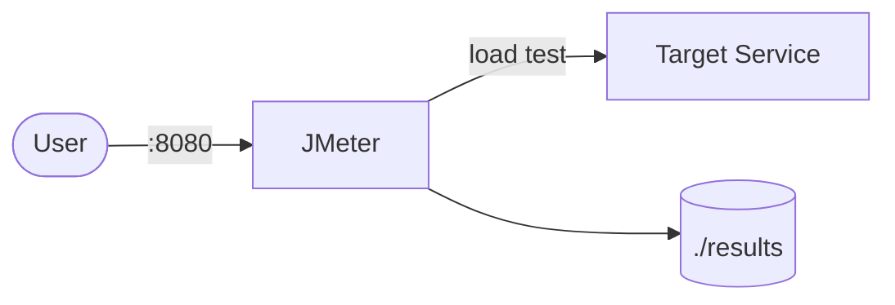

# JMeter

Apache JMeter is a load testing tool for APIs, web apps, and services.  
This stack runs JMeter in non-GUI mode using Docker Compose.

## How it works



1. Place your JMeter test plan (`.jmx`) in the `tests` folder.
2. `jmeter` service stays running for ad-hoc commands.
3. `jmeter-run` profile executes a test plan in headless mode.
4. Result files are written to the `results` folder.

## Stack details in this repo

- Image: `justb4/jmeter:latest`
- Container names:
  - `jmeter` (idle runner container)
  - `jmeter-run` (one-shot test execution)
- Mounted folders:
  - `./tests:/tests` (input test plans)
  - `./results:/results` (output reports/results)
- Default behavior:
  - `jmeter` keeps alive with `sleep infinity`
  - `jmeter-run` executes `test-plan.jmx`

## How to run

From the repository root:

```bash
cd jmeter
docker compose up -d
```

If you use Podman:

```bash
cd jmeter
podman compose up -d
```

Run the default test plan:

```bash
docker compose --profile run up --abort-on-container-exit jmeter-run
```

Podman equivalent:

```bash
podman compose --profile run up --abort-on-container-exit jmeter-run
```

## Run a specific test plan

```bash
docker compose exec jmeter jmeter -n -t /tests/my-plan.jmx -l /results/my-plan.jtl
```

Podman equivalent:

```bash
podman compose exec jmeter jmeter -n -t /tests/my-plan.jmx -l /results/my-plan.jtl
```

## Useful commands

```bash
docker compose exec jmeter jmeter -n -t /tests/test-plan.jmx -l /results/results.jtl -e -o /results/html-report
docker compose down
```

## Notes

- Add your `.jmx` files into `jmeter/tests/`.
- `jmeter-run` expects `tests/test-plan.jmx` to exist.
