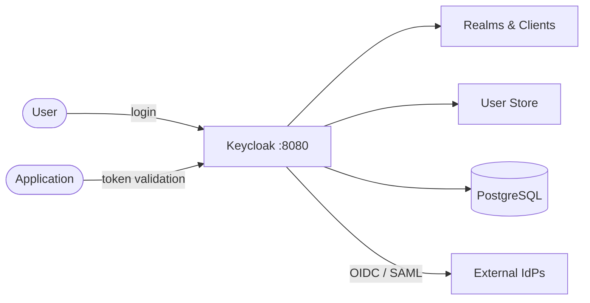

# Keycloak

Keycloak is an open-source identity and access management solution.  
It provides SSO, user federation, social login, and fine-grained authorization out of the box.

## How Keycloak works



1. Users authenticate through Keycloak's login page or API.
2. Keycloak issues tokens (JWT) that applications validate for access control.
3. Realms isolate tenants; clients represent applications registered with Keycloak.
4. User federation connects to LDAP, Active Directory, or external identity providers.
5. PostgreSQL stores realm configuration, users, sessions, and credentials.

## Stack details in this repo

- Keycloak image: `quay.io/keycloak/keycloak:25.0`
- Database image: `postgres:16-alpine`
- Container names: `keycloak`, `keycloak-db`
- Admin console: `http://<host-ip>:8080`
- PostgreSQL port: `5432` (internal only)

## Environment variables

Set via `.env` (copy from `.env.example`):

- `KEYCLOAK_PORT` (default: `8080`)
- `KEYCLOAK_ADMIN` (default: `admin`)
- `KEYCLOAK_ADMIN_PASSWORD` (default: `changeme`)
- `POSTGRES_USER` (default: `keycloak`)
- `POSTGRES_PASSWORD` (default: `changeme`)
- `POSTGRES_DB` (default: `keycloak`)

## How to run

From the repository root:

```bash
cd keycloak
cp .env.example .env
docker compose up -d
```

Open:

- Admin Console: `http://localhost:8080`

Login with the admin credentials from `.env`.

Useful commands:

```bash
docker compose ps
docker compose logs -f keycloak
docker compose restart
docker compose down
```

## Use it effectively

- Create a realm for each tenant or environment (dev, staging, prod).
- Register your applications as clients with the appropriate protocol (OpenID Connect or SAML).
- Use the built-in user federation to connect existing LDAP/AD directories.
- Enable social login (Google, GitHub, etc.) via identity provider configuration.
- Export realm config for version-controlled, reproducible setups.

## Notes

- Change default admin credentials before exposing Keycloak externally.
- The `start-dev` command runs Keycloak in development mode (HTTP, no caching). For production, use `start` with TLS configured.
- See [Keycloak docs](https://www.keycloak.org/documentation) for full configuration reference.
