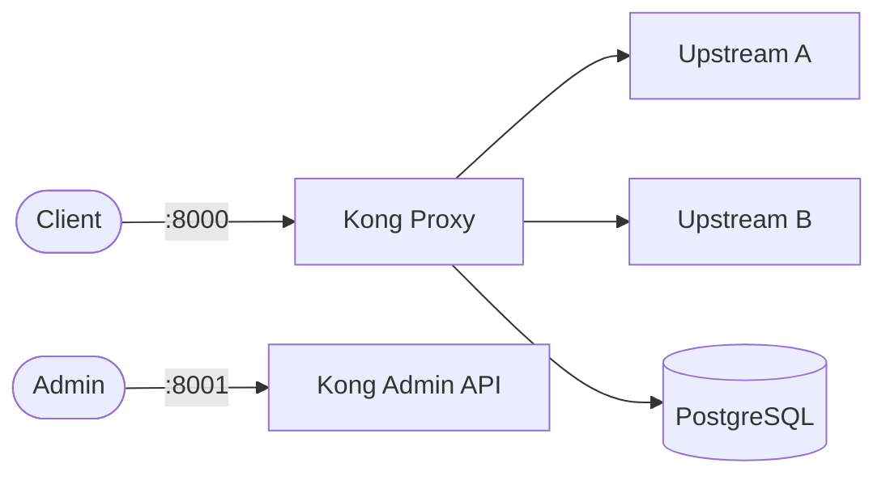

# Kong

Kong is a cloud-native API gateway and platform for managing, securing, and observing APIs and microservices.  
It provides rate limiting, authentication, load balancing, and plugin-based extensibility.

## How Kong works



1. Clients send requests to the Kong proxy port (8000/8443).
2. Kong matches routes and forwards traffic to configured upstream services.
3. Plugins (auth, rate-limit, logging, etc.) execute on each request.
4. The Admin API (port 8001) manages routes, services, consumers, and plugins.
5. PostgreSQL stores all Kong configuration and plugin state.

## Stack details in this repo

- Kong image: `kong:3.7`
- Database image: `postgres:16-alpine`
- Container names: `kong`, `kong-db`, `kong-migration`
- Proxy port: `8000` (HTTP), `8443` (HTTPS)
- Admin API: `http://<host-ip>:8001`
- PostgreSQL: internal only

## Environment variables

Environment files are in the `config/` directory, copied from `config-examples/`:

### `config/kong.env`
Copied from `config-examples/kong.env.example`:
- `KONG_DATABASE` (default: `postgres`)
- `KONG_PG_HOST` (default: `kong-database`)
- `KONG_PG_USER` (default: `kong`)
- `KONG_PG_PASSWORD` (default: `changeme`)
- `KONG_PG_DATABASE` (default: `kong`)
- `KONG_PROXY_ACCESS_LOG` (default: `/dev/stdout`)
- `KONG_ADMIN_ACCESS_LOG` (default: `/dev/stdout`)
- `KONG_PROXY_ERROR_LOG` (default: `/dev/stderr`)
- `KONG_ADMIN_ERROR_LOG` (default: `/dev/stderr`)
- `KONG_ADMIN_LISTEN` (default: `0.0.0.0:8001`)

### `config/kong-db.env`
Copied from `config-examples/kong-db.env.example`:
- `POSTGRES_USER` (default: `kong`)
- `POSTGRES_PASSWORD` (default: `changeme`)
- `POSTGRES_DB` (default: `kong`)

### `config/kong-migration.env`
Copied from `config-examples/kong-migration.env.example`:
- `KONG_DATABASE` (default: `postgres`)
- `KONG_PG_HOST` (default: `kong-database`)
- `KONG_PG_USER` (default: `kong`)
- `KONG_PG_PASSWORD` (default: `changeme`)
- `KONG_PG_DATABASE` (default: `kong`)

Port mappings are defined in `docker-compose.yml` using defaults `8000`, `8443`, `8001` overridden by `KONG_PROXY_PORT`, `KONG_PROXY_SSL_PORT`, `KONG_ADMIN_PORT` respectively.

## How to run

From the repository root:

```bash
cd kong
mkdir config

cp config-examples/kong.env.example config/kong.env
cp config-examples/kong-db.env.example config/kong-db.env
cp config-examples/kong-migration.env.example config/kong-migration.env
docker compose up -d
```

Wait for migrations to complete, then verify:

```bash
curl http://localhost:8001/status
```

Open:

- Proxy: `http://localhost:8000`
- Admin API: `http://localhost:8001`

Useful commands:

```bash
docker compose ps
docker compose logs -f kong
docker compose restart
docker compose down
```

## Use it effectively

- Add a service and route via the Admin API:

```bash
# Create a service
curl -i -X POST http://localhost:8001/services \
  --data name=example-service \
  --data url=http://httpbin.org

# Create a route
curl -i -X POST http://localhost:8001/services/example-service/routes \
  --data paths[]=/example
```

- Enable plugins (rate limiting, key-auth, JWT, etc.) per service or globally.
- Use Kong Manager UI (available in Kong Enterprise) or tools like Konga for a web dashboard.
- Export configuration with `deck` CLI for version-controlled gateway config.

## Notes

- Change default database credentials before exposing externally.
- The migration container runs once and exits — this is expected behavior.
- Admin API should not be exposed publicly in production; restrict access via firewall or bind to localhost.
- See [Kong docs](https://docs.konghq.com/) for full plugin and configuration reference.
