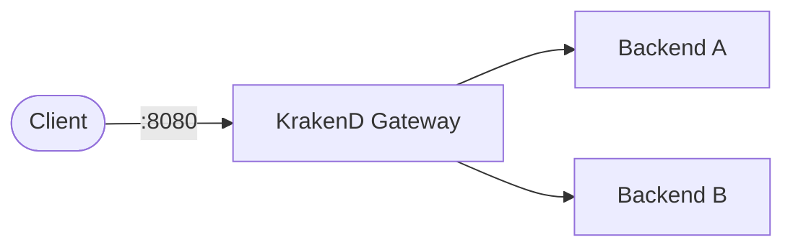

# KrakenD API Gateway

This stack provides a lightweight API Gateway using KrakenD for routing, aggregation, and API composition.

## How it works



1. `krakend` runs as a stateless API Gateway.
2. It exposes a single HTTP entrypoint and routes requests to configured backends.
3. All routing logic is defined in `data/krakend.json`.

## Stack details in this repo

- Services:
  - `krakend` (`devopsfaith/krakend:latest`)

- Ports:
  - KrakenD Gateway: `http://localhost:8080`

- Config:
  - `data/krakend.json` mounted into the container as `/etc/krakend/krakend.json`

- No persistent storage required (stateless gateway)

## Environment variables

This setup is mostly configuration-driven, but optional environment variables can be used for:

- External API keys (if your backends require auth)
- Docker runtime configuration overrides

Recommended to use `.env` for sensitive values if extending the gateway.

---

## How to run

From the repository root:

```bash
cd krakend
cp data-examples/krakend.json.example data/krakend.json
docker compose up -d
```

---

## Docker Compose

```yaml
services:
  krakend:
    image: devopsfaith/krakend:latest
    container_name: krakend
    ports:
      - "8080:8080"
    volumes:
      - ./data/krakend.json:/etc/krakend/krakend.json:ro
    command: ["run", "-c", "/etc/krakend/krakend.json"]
    restart: unless-stopped
```

---

## Useful commands

```bash
docker compose ps
docker compose logs -f
docker compose down
docker compose down -v
```

---

## Test the API Gateway

Example request:

```bash
curl http://localhost:8080/github
```

---

## Notes

- KrakenD is stateless and fully config-driven
- All routing logic lives in `data/krakend.json`
- Backends must be reachable from the container network
- External APIs may require headers (e.g., User-Agent for GitHub)

---

## Recommended Next Steps

- Add JWT authentication layer
- Enable rate limiting per endpoint
- Add caching layer for backend responses
- Introduce multiple environments (dev/staging/prod)
- Add observability (Prometheus + Grafana)
