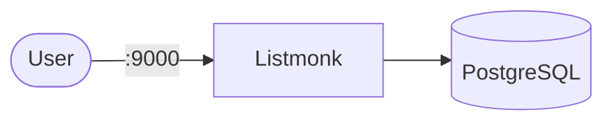

# Listmonk

Listmonk is a self-hosted newsletter and mailing list manager.

## How it works



1. Listmonk provides a web UI for managing subscribers and campaigns.
2. PostgreSQL stores subscribers, templates, and campaign data.
3. The dashboard is exposed on port `9000`.

## Stack details in this repo

- Listmonk image: `listmonk/listmonk:latest`
- Database: `postgres:16`
- UI endpoint: `http://<host-ip>:9000`
- Persistent data: named volumes (`listmonk_data`, `listmonk_uploads`)

## Environment variables

Copy `.env.example` to `.env`:

- `LISTMONK_PORT`
- `LISTMONK_POSTGRES_USER`
- `LISTMONK_POSTGRES_PASSWORD`
- `LISTMONK_POSTGRES_DB`

## How to run

```bash
cd listmonk
cp .env.example .env
docker compose up -d
```

Podman:

```bash
cd listmonk
cp .env.example .env
podman compose up -d
```

## Notes

- First startup initializes the database schema.
- Access the dashboard at `http://localhost:<LISTMONK_PORT>`
- Configure your SMTP settings for sending newsletters.
