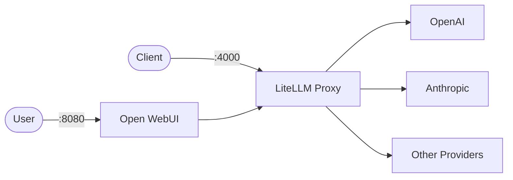

# LiteLLM + Open WebUI

This stack provides a local LLM gateway using LiteLLM (OpenAI-compatible API) and an optional Open WebUI frontend.

## How it works



1. `litellm` runs the LiteLLM proxy and exposes an OpenAI-compatible API (Chat Completions, etc.).
2. `open-webui` is a web UI that connects to LiteLLM using the OpenAI API format.
3. Provider API keys (OpenAI/Anthropic/etc.) are passed to LiteLLM via environment variables and referenced in `litellm_config.yaml`.

## Stack details in this repo

- Services:
  - `litellm` (`ghcr.io/berriai/litellm:main-latest`)
  - `open-webui` (`ghcr.io/open-webui/open-webui:main`)
- Ports:
  - LiteLLM API: `http://localhost:4000`
  - Open WebUI: `http://localhost:8080`
- Config:
  - `litellm_config.yaml` mounted into the container as `/app/config.yaml`
- Persistent data:
  - `open-webui-data:/app/backend/data`

## Environment variables

Set via `.env` (copy from `.env.example`):

- `LITELLM_PORT`
- `OPEN_WEBUI_PORT`
- `LITELLM_MASTER_KEY`
- `OPENAI_API_KEY` (optional)
- `ANTHROPIC_API_KEY` (optional)

## How to run

From the repository root:

```bash
cd litellm
cp .env.example .env
docker compose up -d
```

Open:

- LiteLLM API: `http://localhost:4000`
- Open WebUI: `http://localhost:8080`

Useful commands:

```bash
docker compose ps
docker compose logs -f
docker compose down
docker compose down -v
```

## Test the API

LiteLLM exposes an OpenAI-compatible endpoint via `/v1`.

Example (Chat Completions):

```bash
curl http://localhost:4000/v1/chat/completions \
  -H "Authorization: Bearer <LITELLM_MASTER_KEY>" \
  -H "Content-Type: application/json" \
  -d '{
    "model": "gpt-4o",
    "messages": [
      { "role": "user", "content": "Hello from LiteLLM" }
    ]
  }'
```

## Notes

- Set a strong `LITELLM_MASTER_KEY` before exposing this stack outside your machine.
- Update `litellm_config.yaml` `model_list` to match the providers/models you want to route to.
