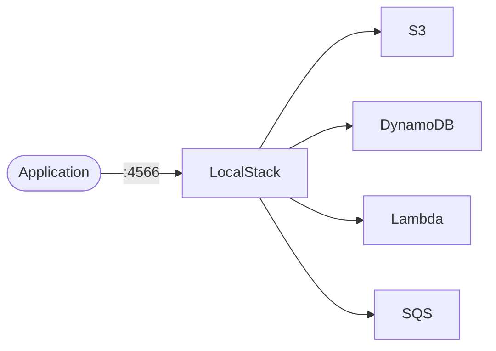

# LocalStack

LocalStack emulates AWS services locally for development and testing.  
This stack starts selected AWS-like services behind one edge endpoint.

## How it works



1. LocalStack starts service emulators defined in `SERVICES`.
2. Client SDK/CLI requests go to LocalStack edge port `4566`.
3. Service state is stored under the mounted local data directory.
4. Lambda and other features may use Docker via mounted `docker.sock`.

## Stack details in this repo

- Image: `localstack/localstack:latest`
- Container name: `localstack`
- Ports:
  - `4566` (edge endpoint)
  - `4571`
- Enabled services (current default):
  - `s3,dynamodb,sqs,lambda,iam,ec2,cloudwatch,route53`
- Persistent data:
  - `./data:/var/lib/localstack`
- Docker access:
  - `/var/run/docker.sock:/var/run/docker.sock`

## Environment variables

Configured in compose:

- `SERVICES`
- `DEBUG`
- `AWS_DEFAULT_REGION`
- `DATA_DIR`

## How to run

From the repository root:

```bash
cd localstack
docker compose up -d
```

Health check:

```bash
curl http://localhost:4566/_localstack/health
```

Useful commands:

```bash
docker compose ps
docker compose logs -f
docker compose restart
docker compose down
```

## Notes

- Point AWS SDK/CLI endpoints to `http://localhost:4566` for local testing.
- Reduce `SERVICES` list if you only need a small subset to save resources.
