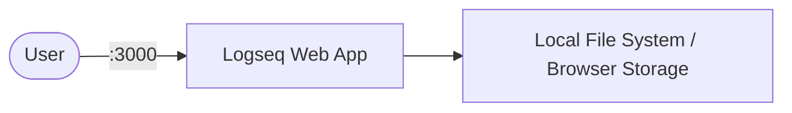

# Logseq

Logseq is a privacy-first, open-source knowledge management and collaboration platform.  
This stack runs the Logseq web app, providing a browser-based interface for your knowledge graph.

## How Logseq works



1. Logseq starts a web server serving the Logseq single-page application.
2. Users access the UI in a browser to create and manage notes, pages, and graphs.
3. Data is stored locally in the browser (IndexedDB) or can be synced to a Git repository.

## Stack details in this repo

- Image: `ghcr.io/logseq/logseq-webapp:latest`
- Container name: `logseq`
- Web UI: `http://<host-ip>:3000`

## How to run

From the repository root:

```bash
cd logseq
docker compose up -d
```

Open:

- Logseq UI: `http://localhost:3000`

Useful commands:

```bash
docker compose ps
docker compose logs -f
docker compose restart
docker compose down
```

## Use it effectively

- Logseq supports both Markdown and Org-mode for note-taking.
- Use the graph view to visualize connections between pages.
- Enable Git auto-sync to back up your knowledge base.
- Install the PWA for a more native experience.

## Notes

- All data is stored client-side (in browser IndexedDB) by default.
- The container is stateless — no persistent volume is required.
- Change the host port mapping if `3000` conflicts with other services.
- See [Logseq GitHub](https://github.com/logseq/logseq) for more details.
