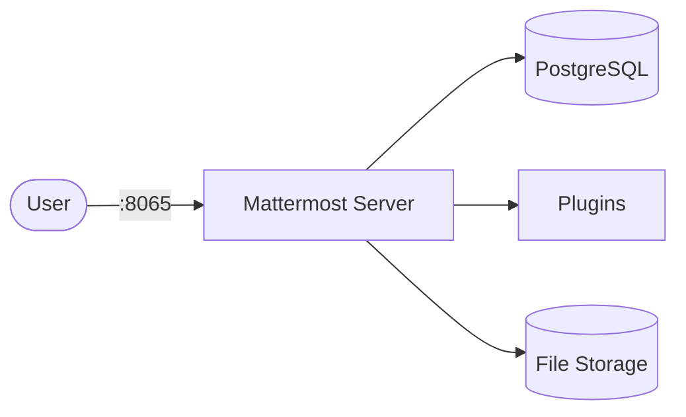

# Mattermost

Mattermost is a self-hosted team messaging platform — an open-source alternative to Slack.  
It provides channels, direct messages, file sharing, integrations, and plugin support.

## How Mattermost works



1. Mattermost serves the web UI and API on port 8065.
2. PostgreSQL stores users, channels, messages, and configuration.
3. File uploads and attachments persist in the data volume.
4. Plugins and integrations extend functionality (webhooks, bots, slash commands).

## Stack details in this repo

- Mattermost image: `mattermost/mattermost-team-edition:latest`
- Database image: `postgres:16-alpine`
- Container names: `mattermost`, `mattermost-db`
- Web UI: `http://<host-ip>:8065`
- Persistent data:
  - `mattermost_data:/mattermost/data`
  - `mattermost_config:/mattermost/config`
  - `mattermost_plugins:/mattermost/plugins`
  - `mattermost_logs:/mattermost/logs`
  - `mattermost_db:/var/lib/postgresql/data`

## Environment variables

Set via `.env` (copy from `.env.example`):

- `MATTERMOST_PORT` (default: `8065`)
- `POSTGRES_USER` (default: `mattermost`)
- `POSTGRES_PASSWORD` (default: `changeme`)
- `POSTGRES_DB` (default: `mattermost`)

## How to run

From the repository root:

```bash
cd mattermost
cp .env.example .env
docker compose up -d
```

Open:

- Mattermost UI: `http://localhost:8065`

On first access, create your admin account and team.

Useful commands:

```bash
docker compose ps
docker compose logs -f mattermost
docker compose restart
docker compose down
```

## Use it effectively

- Create teams and channels to organize communication by project or topic.
- Set up incoming/outgoing webhooks for CI/CD notifications.
- Install plugins from the Marketplace (Jira, GitHub, Zoom, etc.).
- Use slash commands for quick actions and bot integrations.

## Notes

- Change default database credentials before exposing externally.
- First startup may take a minute while the database initializes.
- For production, configure a reverse proxy with TLS in front of Mattermost.
- See [Mattermost docs](https://docs.mattermost.com/) for full configuration reference.
