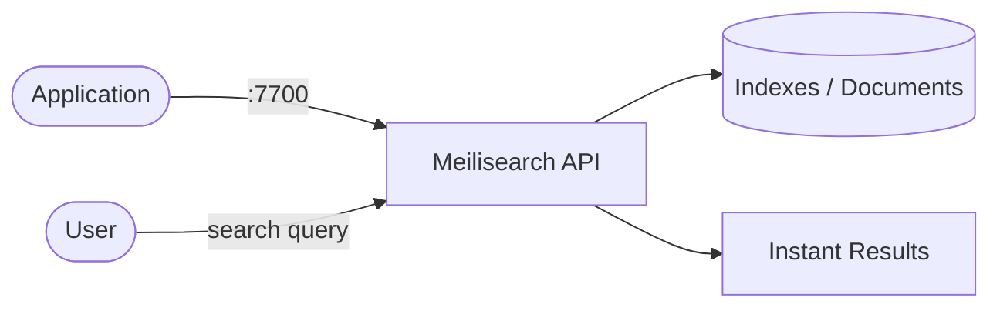

# Meilisearch

Meilisearch is a fast, typo-tolerant full-text search engine with a simple REST API.  
It provides instant search results, faceted filtering, and relevancy tuning out of the box.

## How Meilisearch works



1. Applications index documents by sending JSON payloads to the REST API.
2. Meilisearch builds optimized search indexes for instant retrieval.
3. Search queries return ranked, typo-tolerant results in milliseconds.
4. Faceted search, filtering, and sorting are supported natively.

## Stack details in this repo

- Image: `getmeili/meilisearch:v1.9`
- Container name: `meilisearch`
- API endpoint: `http://<host-ip>:7700`
- Persistent data:
  - `meili_data:/meili_data`

## Environment variables

Set via `.env` (copy from `.env.example`):

- `MEILI_PORT` (default: `7700`)
- `MEILI_MASTER_KEY` (default: `changeme`) — API key for authentication
- `MEILI_ENV` (default: `development`) — set to `production` to enforce key auth

## How to run

From the repository root:

```bash
cd meilisearch
cp .env.example .env
docker compose up -d
```

Test the API:

```bash
# Check health
curl http://localhost:7700/health

# Create an index and add documents
curl -X POST http://localhost:7700/indexes/movies/documents \
  -H "Authorization: Bearer changeme" \
  -H "Content-Type: application/json" \
  --data-binary '[
    {"id": 1, "title": "The Matrix", "genre": "sci-fi"},
    {"id": 2, "title": "Inception", "genre": "sci-fi"},
    {"id": 3, "title": "Interstellar", "genre": "sci-fi"}
  ]'

# Search
curl "http://localhost:7700/indexes/movies/search?q=matrx" \
  -H "Authorization: Bearer changeme"
```

Useful commands:

```bash
docker compose ps
docker compose logs -f
docker compose restart
docker compose down
```

## Use it effectively

- Sample data is seeded automatically on `docker compose up` (the `seed` container indexes movies and exits).
- Run manual searches after startup:

```bash
# Search with typo tolerance
curl "http://localhost:7700/indexes/movies/search" \
  -H "Authorization: Bearer changeme" \
  -H "Content-Type: application/json" \
  -d '{"q": "interstllar"}'

# Filter by genre
curl "http://localhost:7700/indexes/movies/search" \
  -H "Authorization: Bearer changeme" \
  -H "Content-Type: application/json" \
  -d '{"q": "", "filter": "genre = action"}'
```

- Use the SDKs (JavaScript, Python, Go, PHP, etc.) for easy integration.
- Configure searchable attributes, ranking rules, and stop words per index.
- Enable faceted search for category/filter UIs.
- Use `MEILI_ENV=production` in production to require API key authentication on all endpoints.

## Notes

- Change the default master key before exposing externally.
- In development mode, the API is accessible without authentication for convenience.
- Data persists across restarts via the `meili_data` volume.
- See [Meilisearch docs](https://www.meilisearch.com/docs) for full API and configuration reference.
