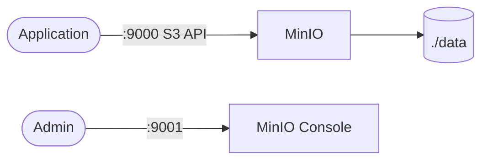

# MinIO

MinIO is an S3-compatible object storage server for self-hosted environments.  
This stack runs MinIO with local persistent data and web console access.

## How it works



1. MinIO starts in standalone mode with `/data` as object storage path.
2. S3-compatible API is exposed on port `9000`.
3. Web console is exposed on port `9001`.
4. Objects and metadata persist in the mounted `./data` directory.

## Stack details in this repo

- Image: `minio/minio:latest`
- Container name: `minio`
- API endpoint: `http://<host-ip>:9000`
- Console: `http://<host-ip>:9001`
- Persistent data:
  - `./data:/data`
- Startup command:
  - `server /data --console-address ":9001"`

## Environment variables

Configured in compose:

- `MINIO_ROOT_USER`
- `MINIO_ROOT_PASSWORD`

`.env.example` is available, but this compose currently sets credentials inline.

## How to run

From the repository root:

```bash
cd miniio
docker compose up -d
```

Open:

- API: `http://localhost:9000`
- Console: `http://localhost:9001`

Useful commands:

```bash
docker compose ps
docker compose logs -f
docker compose restart
docker compose down
```

## Notes

- Change default credentials before using beyond local testing.
- MinIO requires a strong password (at least 8 characters).
