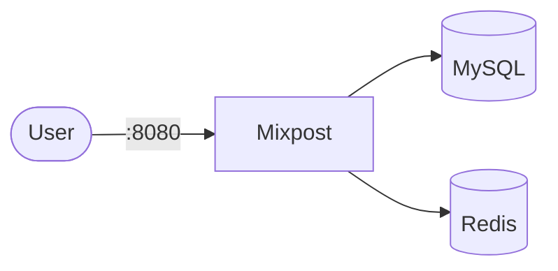

# Mixpost

Mixpost is a self-hosted social media management and scheduling platform.

## How it works



1. Mixpost provides a web UI for managing social media accounts.
2. MySQL stores accounts, posts, schedules, and analytics.
3. Redis handles caching and queue processing.
4. Posts are scheduled and published to connected social accounts.

## Stack details in this repo

- Mixpost image: `inovector/mixpost:latest`
- Database: `mysql:8`
- Cache: `redis:7-alpine`
- UI endpoint: `http://<host-ip>:8080`
- Persistent data: named volumes (`mixpost_db_data`, `mixpost_redis_data`, `mixpost_uploads`)

## Environment variables

Copy `.env.example` to `.env`:

- `MIXPOST_APP_URL` - URL where Mixpost is accessible
- `MIXPOST_TRACKING_ENABLED` - Enable/disable analytics tracking
- Social media API credentials for each platform you want to connect

## How to run

```bash
cd mixpost
cp .env.example .env
docker compose up -d
```

Podman:

```bash
cd mixpost
cp .env.example .env
podman compose up -d
```

## First setup

1. Open `http://localhost:8080`
2. Create your admin account on first login
3. Connect your social media accounts in Settings
4. Start scheduling posts!

## Useful commands

```bash
docker compose ps
docker compose logs -f mixpost
docker compose restart
docker compose down
docker compose down -v  # includes volumes
```

## Notes

- MySQL initialization may take a few minutes on first startup.
- Ensure your server has enough memory for MySQL 8.
- Configure cron or a scheduler for post publishing if needed.
