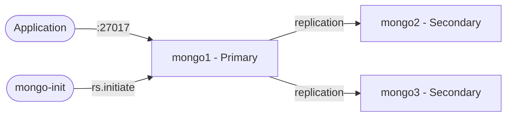

# MongoDB Replica Set

A 3-node MongoDB replica set for local development and testing.  
Provides high availability, automatic failover, and oplog tailing for applications that require replica set features.

## How MongoDB Replica Set works



1. Three MongoDB nodes start with `--replSet rs0` to form a replica set.
2. The `mongo-init` container waits for all nodes, then initializes the replica set.
3. One node is elected as primary (handles writes); the others are secondaries (replicate data).
4. If the primary goes down, a secondary is automatically elected as the new primary.

## Stack details in this repo

- Image: `mongo:7`
- Container names: `mongo1`, `mongo2`, `mongo3`, `mongo-init`
- Ports:
  - `27017` → mongo1 (primary)
  - `27018` → mongo2 (secondary)
  - `27019` → mongo3 (secondary)
- Replica set name: `rs0`
- Persistent data:
  - `mongo1:/data/db`
  - `mongo2:/data/db`
  - `mongo3:/data/db`

## How to run

From the repository root:

```bash
cd mongodb-replicaset
docker compose up -d
```

Wait ~15 seconds for initialization, then connect:

```bash
# Direct connection to primary (from host)
mongosh "mongodb://localhost:27017/?directConnection=true"

# Or add to hosts file (C:\Windows\System32\drivers\etc\hosts or /etc/hosts):
#   127.0.0.1 mongo1 mongo2 mongo3
# Then use full replica set connection:
mongosh "mongodb://mongo1:27017,mongo2:27018,mongo3:27019/?replicaSet=rs0"
```

Check replica set status:

```bash
mongosh --host localhost:27017 --eval "rs.status()" --quiet
```

Useful commands:

```bash
docker compose ps
docker compose logs -f mongo-init
docker compose logs -f mongo1
docker compose restart
docker compose down
```

## Use it effectively

- Connect applications using the full replica set connection string:
  ```
  mongodb://mongo1:27017,mongo2:27017,mongo3:27017/?replicaSet=rs0
  ```
  (From host, use `directConnection=true` or add container names to your hosts file.)
- Use for testing oplog-dependent features (Rocket.Chat, Meteor, change streams).
- Simulate failover by stopping the primary: `docker compose stop mongo1`
- Monitor elections and replication lag via `rs.status()`.

## Notes

- The `mongo-init` container runs once and exits — this is expected.
- All three nodes must be running for the initial `rs.initiate()` to succeed.
- Data persists across restarts via named volumes.
- For applications running inside Docker, use container names (`mongo1:27017`) instead of `localhost`.
- No authentication is configured by default; add `--keyFile` for production use.

## Replica Set vs Sharding Cluster

| Feature                | Replica Set                                | Sharding Cluster                              |
| ---------------------- | ------------------------------------------ | --------------------------------------------- |
| Purpose                | High availability & failover               | Horizontal scaling & data distribution        |
| Nodes                  | 3 (1 primary + 2 secondaries)              | 7+ (config servers + shard nodes + router)    |
| Data distribution      | All nodes hold the same data               | Data split across shards by shard key         |
| Write scaling          | Single primary handles all writes          | Writes distributed across shard primaries     |
| Read scaling           | Read from secondaries with read preference | Reads routed to relevant shard                |
| Failover               | Automatic (secondary promoted to primary)  | Per-shard automatic failover                  |
| Use case               | Most applications, moderate traffic        | Large datasets, high throughput, multi-tenant |
| Complexity             | Low                                        | High                                          |
| Connection             | Direct to any node or replica set URI      | Always through mongos router                  |
| Minimum for production | 3 nodes                                    | 9+ nodes (config RS + shard RS + mongos)      |

**When to use Replica Set:** Your data fits on a single server and you need redundancy and automatic failover.

**When to use Sharding:** Your data or write throughput exceeds what a single replica set can handle, or you need geographic data distribution.

See also: [mongodb-sharding-cluster](../mongodb-sharding-cluster)
